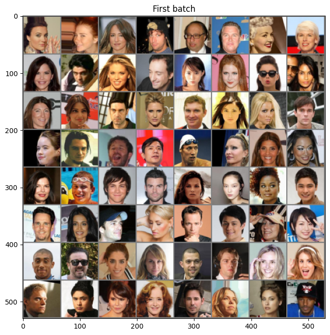

# Celeb A

import CodeDescription from "@site/src/components/CodeDescription";

본 튜토리얼에서 사용하는 데이터는 대표적인 toy example 로 사용되는 데이터 중 하나인 CelebA 데이터입니다.
CelebA 데이터는 유명 연예인들의 얼굴로 이루어져 있는 데이터 입니다.
64*64의 사이즈로 비교적 작은 편이며 RGB 3개의 채널이 있어서 더 사실적인 이미지를 그리기 위해서 적절한 데이터셋입니다.

그래서 본 튜토리얼에서는 생성을 위한 GAN 에서는 이 데이터를 이용해 생성을 할 예정입니다.

CelebA 데이터는 `torchvision` 패키지에서 쉽게 다운로드 받고 사용할 수 있습니다.
다만 데이터를 다운로드 받기 위한 경로가 grive 가 필요해 gdrive 패키지를 먼저 설치해야 합니다.

```python
pip install gdown
```

이제 데이터를 다운로드 받고 데이터 로더로 만드는 코드를 작성합니다.

<CodeDescription>
```python
import torchvision.transforms as T
from torchvision.datasets.celeba import CelebA
from torch.utils.data import DataLoader

transform = Compose(
    [
        T.Resize(64),
        T.CenterCrop(64),
        T.ToTensor(),
        T.Normalize((0.5, 0.5, 0.5), (0.5, 0.5, 0.5)),
    ]
)
dataset = CelebA("./datasets", download=True, transform=transform)
loader = DataLoader(dataset, batch_size=128, shuffle=True)
````

- `transform`
    - 데이터 로더를 만든 후 데이터를 불러올 때 데이터를 처리하기 위한 코드입니다.
    - `T.Resize(64)` : 데이터를 64 사이즈로 조절합니다.
    - `T.CenterCrop(64)` : 데이터를 중앙을 중심으로 64 사이즈로 자릅니다.
    - `T.ToTensor()` : 데이터를 Tensor 로 변환합니다.
    - `T.Normalize((0.5, 0.5, 0.5), (0.5, 0.5, 0.5))` : 이미지의 각 채널을 평균을 0.5 분산을 0.5 로 정규화합니다.
- `dataset`
    - `CelebA` 클래스를 이용해 데이터셋 형태로 다운로드 받습니다. 
    - `./datasets` : 데이터를 다운로드 받을 경로를 지정합니다.
    - `download` : 데이터의 다운로드를 지정합니다.
    - `transform` : index 를 이용해 데이터를 불러올 때 사용할 변환 코드를 입력합니다.
- `loader`
    - `DataLoader` 클래스를 이용해 데이터 로더 형태로 변홥합니다.
    - `datasets` : 사용할 데이터셋을 입력합니다.
    - `batch_size` : 한 배치에 사용할 데이터의 개수를 입력합니다. 사양이 부족한 경우 한 배치의 개수를 적게 입력합니다.
    - `shuffle` : 데이터를 랜덤하게 추출할 지 여부입니다.

</CodeDescription>

다운로드 받은 데이터의 첫번째 배치를 plot 으로 그려서 확인해 보겠습니다.

<CodeDescription>
```python
import numpy as np
import matplotlib.pyplot as plt
from torchvision.utils import make_grid

for batch in loader:
    batch_grid = make_grid(batch[0], nrow=12).numpy()
    break

plt.figure(figsize=(8, 8))
plt.title("First batch")

# make data range to 0~1
batch_grid = (batch_grid * 0.5) + 0.5
plt.imshow(np.transpose(batch_grid, (1, 2, 0)))
````
- `make_grid`:
    - 이미지 데이터를 모아서 하나의 plot 으로 만들 때 유용한 util 도구입니다.
- `(batch_grid * 0.5) + 0.5`
    - `plt.imshow` 함수는 데이터가 0~1 사이에 있어야 잘 그려집니다. 이를 위해서 데이터를 역 정규화 합니다.
</CodeDescription>

위 코드를 실행하면 아래와 같은 이미지를 얻을 수 있습니다.


