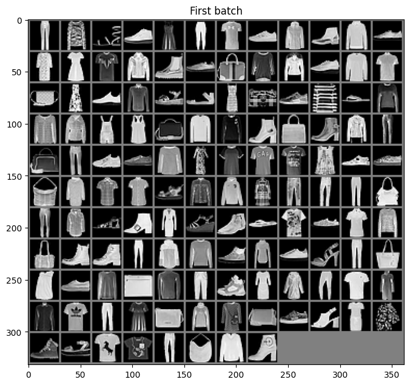

# Fashion-MNIST

import CodeDescription from "@site/src/components/CodeDescription";
import BrowserWindow from "@site/src/components/BrowserWindow";

본 튜토리얼에서 사용하는 데이터는 대표적인 toy example 로 사용되는 데이터 중 하나인 Fashion MNIST 데이터입니다.
Fashion MNIST 데이터는 흑백의 데이터로 채널수가 작고 이미지 크기도 작아서 적은 학습 Epoch 만으로도 생성할 수 있다는 장점이 있습니다.

그래서 본 튜토리얼에서는 간단한 구조를 파악하기 위한 예제에서는 Fashion MNIST 데이터를 이용할 예정입니다.

튜토리얼에서 사용할 때는 원본과 Generation / Reconstruction 된 이미지들과 비교가 이루어집니다.
그렇기에 들어가기에 앞서 Fashion MNIST 데이터에 대해서 확인해 보도록 하겠습니다.

Fashion MNIST 데이터는 `torchvision` 패키지에서 쉽게 다운로드 받고 사용할 수 있습니다.

<CodeDescription>
```python showLineNumbers
from torchvision.transforms import Compose, ToTensor, Lambda
from torchvision.datasets.mnist import FashionMNIST
from torch.utils.data import DataLoader

transform = Compose(
    [
        ToTensor(),
        Lambda(lambda x: (x - 0.5) * 2),
    ]
)
dataset = FashionMNIST(
    "./datasets", download=True, train=True, transform=transform
)
loader = DataLoader(dataset, batch_size=128, shuffle=True)
```

- `transform`
    - 데이터 로더를 만든 후 데이터를 불러올 때 데이터를 처리하기 위한 코드입니다.
    - `ToTensor()` : 데이터를 Tensor 로 변환합니다.
    - `Lambda(lambda x: (x - 0.5) * 2)` : 데이터를 0~1 사이로 변환합니다.
- `dataset`
    - `FashionMNIST` 클래스를 이용해 데이터셋 형태로 다운로드 받습니다. 
    - `./datasets` : 데이터를 다운로드 받을 경로를 지정합니다.
    - `download` : 데이터의 다운로드를 지정합니다.
    - `train` : `True` 면 train 데이터 `False` 면 test 데이터를 사용합니다.
    - `transform` : index 를 이용해 데이터를 불러올 때 사용할 변환 코드를 입력합니다.
- `loader`
    - `DataLoader` 클래스를 이용해 데이터 로더 형태로 변홥합니다.
    - `datasets` : 사용할 데이터셋을 입력합니다.
    - `batch_size` : 한 배치에 사용할 데이터의 개수를 입력합니다. 사양이 부족한 경우 한 배치의 개수를 적게 입력합니다.
    - `shuffle` : 데이터를 랜덤하게 추출할 지 여부입니다.

</CodeDescription>

다운로드 받은 데이터의 첫번째 배치를 plot 으로 그려서 확인해 보겠습니다.

<CodeDescription>
<BrowserWindow>
```python showLineNumbers
import matplotlib.pyplot as plt
from torchvision.utils import make_grid

for batch in loader:
    batch_grid = make_grid(batch[0], nrow=12).numpy()
    break

plt.figure(figsize=(8, 8))
plt.title("First batch")
plt.imshow(batch_grid[0], cmap="gray")
```

</BrowserWindow>

- `make_grid`:
    - 이미지 데이터를 모아서 하나의 plot 으로 만들 때 유용한 util 도구입니다.
</CodeDescription>
