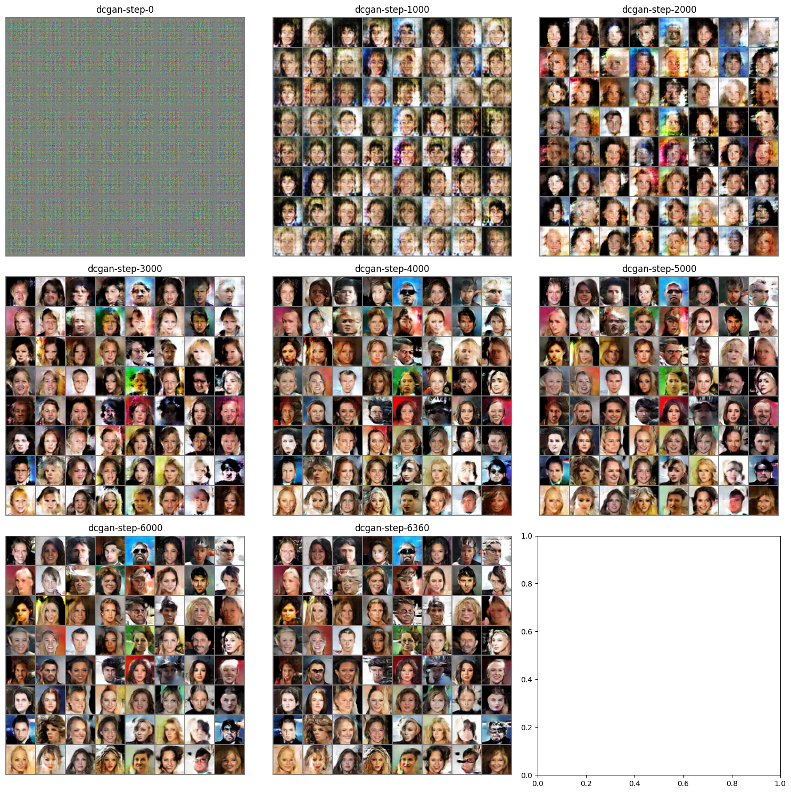

# Deep Convolutional GAN

import CodeDescription from "@site/src/components/CodeDescription";
import useBaseUrl from '@docusaurus/useBaseUrl';


이번 페이지에서는 CNN 을 이용해 이미지 생성 모델의 시작을 알린 DCGAN (Deep Convolutional GAN) 을 이용해 생성형 모델을 학습하는 방법에 대해서 설명합니다.


## Dataset
우선 튜토리얼에 들어가기에 앞서 사용할 데이터셋을 선언합니다.
데이터셋에 대한 자세한 설명은 [CelebA](../dataset/celeba) 페이지에서 확인할 수 있습니다.

```python
import numpy as np
import matplotlib.pyplot as plt
from torchvision.utils import make_grid

for batch in loader:
    batch_grid = make_grid(batch[0], nrow=12).numpy()
    break

plt.figure(figsize=(8, 8))
plt.title("First batch")

# make data range to 0~1
batch_grid = (batch_grid * 0.5) + 0.5
plt.imshow(np.transpose(batch_grid, (1, 2, 0)))
```

## Model

이제 본격적으로 모델 코드를 작성해 보겠습니다.

논문에서는 안정적인 DCGAN 을 학습하기 위한 가이드라인을 아래와 같이 제시했습니다.
<CodeDescription>
Architecture guidelines for stable Deep Convolutional GANs
- Replace any pooling layers with strided convolutions (discriminator) and fractional-strided convolutions (generator).
- Use batchnorm in both the generator and the discriminator.
- Remove fully connected hidden layers for deeper architectures.
- Use ReLU activation in generator for all layers except for the output, which uses Tanh.
- Use LeakyReLU activation in the discriminator for all layers
</CodeDescription>

이제 논문에서 제시한 내용에 맞춰서 모델을 작성해 보겠습니다.

### Generator
#### Code
작성할 모델의 아키텍쳐는 논문에서 제시한 형태를 따라갑니다.


```python
import torch
import torch.nn as nn


class Generator(nn.Module):
    def __init__(self, num_channel=3, latent_dim=100, feature_dim=64):
        super().__init__()

        self.layer_1 = nn.Sequential(
            nn.ConvTranspose2d(latent_dim, feature_dim * 8, 4, 1, 0, bias=False),
            nn.BatchNorm2d(feature_dim * 8),
            nn.ReLU(True),
        )
        self.layer_2 = nn.Sequential(
            nn.ConvTranspose2d(feature_dim * 8, feature_dim * 4, 4, 2, 1, bias=False),
            nn.BatchNorm2d(feature_dim * 4),
            nn.ReLU(True),
        )
        self.layer_3 = nn.Sequential(
            nn.ConvTranspose2d(feature_dim * 4, feature_dim * 2, 4, 2, 1, bias=False),
            nn.BatchNorm2d(feature_dim * 2),
            nn.ReLU(True),
        )
        self.layer_4 = nn.Sequential(
            nn.ConvTranspose2d(feature_dim * 2, feature_dim, 4, 2, 1, bias=False),
            nn.BatchNorm2d(feature_dim),
            nn.ReLU(True),
        )
        self.last_layer = nn.Sequential(
            nn.ConvTranspose2d(feature_dim, num_channel, 4, 2, 1, bias=False),
            nn.Tanh(),
        )

    def forward(self, z):
        # decoding
        layer_1_out = self.layer_1(z)  # (N, 512, 4, 4)
        layer_2_out = self.layer_2(layer_1_out)  # (N, 256, 8, 8)
        layer_3_out = self.layer_3(layer_2_out)  # (N, 128, 16, 16)
        layer_4_out = self.layer_4(layer_3_out)  # (N, 64, 32, 32)
        # transform to rgb
        out = self.last_layer(layer_4_out)  # (N, 3, 64, 64)
        return out

```

안정적인 학습을 위해 위에서 제시된 항목들을 지켜서 아키텍쳐를 구성했습니다.
> Architecture guidelines for stable Deep Convolutional GANs
> - Replace any pooling layers with fractional-strided convolutions (generator).
> - Use batchnorm in the generator.
> - Remove fully connected hidden layers for deeper architectures.
> - Use ReLU activation in generator for all layers except for the output, which uses Tanh.


#### Execution

이번에는 생성기의 내부 코드가 어떻게 동작하는 지 확인해 보도록 하겠습니다.

<CodeDescription>
```python
latent_dim = 100
generator = Generator(latent_dim=latent_dim)

z = torch.rand(128, latent_dim, 1, 1) # (N, 100, 1, 1)

with torch.no_grad():
    # decoding
    layer_1_out = generator.layer_1(z)  # (N, 512, 4, 4)
    layer_2_out = generator.layer_2(layer_1_out)  # (N, 256, 8, 8)
    layer_3_out = generator.layer_3(layer_2_out)  # (N, 128, 16, 16)
    layer_4_out = generator.layer_4(layer_3_out)  # (N, 64, 32, 32)
    # transform to rgb
    out = generator.last_layer(layer_4_out)  # (N, 3, 64, 64)
```

- 입력 `z`
    - 생성기의 입력값은 생성할 이미지들의 정보가 있는 latent space 에서 추출한 값입니다.
    - 이 텐서의 차원은 (N, 100, 1, 1) 입니다.
- 실행을 한 후 각 중간 텐서들의 shape 을 확인하면 다음과 같이 됩니다.
    1. (N, 512, 4, 4)
    2. (N, 256, 8, 8)
    3. (N, 128, 16, 16)
    4. (N, 64, 32, 32)
- 출럭 `out`
    - 최종 출력으로 나오는 데이터는 이미지입니다.
    - 그렇기 때문에 텐서의 차원은 (N, 3, 64, 64) 입니다.
    - 각각 배치수, 채널수, 넓이, 높이 입니다.
</CodeDescription>


#### Visualize

학습되지 않은 생성기가 생성하는 이미지를 확인해 보겠습니다.

```python
import matplotlib.pyplot as plt
from torchvision.utils import make_grid


out_x_grid = make_grid(out, nrow=12).numpy()

plt.figure(figsize=(8, 8))
plt.title("First batch")

# make data range to 0~1
out_x_grid = (out_x_grid * 0.5) + 0.5
plt.imshow(np.transpose(out_x_grid, (1, 2, 0)))
```

아래처럼 알 수 없는 노이즈들입니다.


### Discriminator

이제 생성된 데이터 가짜 데이터와 진짜 데이터를 분류할 모델을 작성해 보겠습니다.

#### Code

```python
class Discriminator(nn.Module):
    def __init__(self, num_channel=3, feature_dim=64):
        super().__init__()
        self.layer_1 = nn.Sequential(
            nn.Conv2d(num_channel, feature_dim, 4, 2, 1, bias=False),
            nn.BatchNorm2d(feature_dim),
            nn.LeakyReLU(0.2, inplace=True),
        )
        self.layer_2 = nn.Sequential(
            nn.Conv2d(feature_dim, feature_dim * 2, 4, 2, 1, bias=False),
            nn.BatchNorm2d(feature_dim * 2),
            nn.LeakyReLU(0.2, inplace=True),
        )
        self.layer_3 = nn.Sequential(
            nn.Conv2d(feature_dim * 2, feature_dim * 4, 4, 2, 1, bias=False),
            nn.BatchNorm2d(feature_dim * 4),
            nn.LeakyReLU(0.2, inplace=True),
        )
        self.layer_4 = nn.Sequential(
            nn.Conv2d(feature_dim * 4, feature_dim * 8, 4, 2, 1, bias=False),
            nn.BatchNorm2d(feature_dim * 8),
            nn.LeakyReLU(0.2, inplace=True),
        )

        self.last_layer = nn.Sequential(
            nn.Conv2d(feature_dim * 8, 1, 4, 1, 0, bias=False), nn.Sigmoid()
        )

    def forward(self, x):
        # encoding
        layer_1_out = self.layer_1(x)  # (N, 64, 32, 32)
        layer_2_out = self.layer_2(layer_1_out)  # (N, 128, 16, 16)
        layer_3_out = self.layer_3(layer_2_out)  # (N, 256, 8, 8)
        layer_4_out = self.layer_4(layer_3_out)  # (N, 512, 4, 4)
        # classify
        out = self.last_layer(layer_4_out).squeeze()  # (N)
        return out
```

안정적인 학습을 위해 위에서 제시된 항목들을 지켜서 아키텍쳐를 구성했습니다.
> Architecture guidelines for stable Deep Convolutional GANs
> - Replace any pooling layers with strided convolutions (discriminator).
> - Use batchnorm in the discriminator.
> - Remove fully connected hidden layers for deeper architectures.
> - Use LeakyReLU activation in the discriminator for all layers

#### Execution

이번에는 분류기의 내부 코드가 어떻게 동작하는 지 확인해 보도록 하겠습니다.

<CodeDescription>
```python
discriminator = Discriminator()

for batch in loader:
    x = batch[0]
    break
    
with torch.no_grad():
    # encoding
    layer_1_out = discriminator.layer_1(x)  # (N, 64, 32, 32)
    layer_2_out = discriminator.layer_2(layer_1_out)  # (N, 128, 16, 16)
    layer_3_out = discriminator.layer_3(layer_2_out)  # (N, 256, 8, 8)
    layer_4_out = discriminator.layer_4(layer_3_out)  # (N, 512, 4, 4)
    # classify
    out = discriminator.last_layer(layer_4_out).squeeze()  # (N)
```

- 입력 `x`
    - 분류기의 입력값은 생성된 혹은 진짜 이미지 입니다.
    - 그렇기 때문에 입력 텐서의 차원은 (N, 3, 64, 64) 입니다.
- 실행을 한 후 각 중간 텐서들의 shape 을 확인하면 다음과 같이 됩니다.
    1. (N, 64, 32, 32)
    2. (N, 128, 16, 16)
    3. (N, 256, 8, 8)
    4. (N, 512, 4, 4)
- 출럭 `out`
    - 최종 출력으로 나오는 데이터는 각 이미지들의 진짜 혹은 가짜를 구분하기 위한 확률값입니다.
    - 이 때, `discriminator.last_layer` 레이어를 통해서 나온 결과는 `(N, 1, 1, 1)` 의 shape 을 갖습니다.
    - `squeeze()` : 좀 더 활용하기 쉽게 `squeeze` 옵션을 통해서 1로 이루어진 모든 차원을 제거해 `(N, 1)` shape 으로 변경합니다.

</CodeDescription>


분류된 결과물을 간단하게 확인합니다.

```python
out[:10]
```

아래와 같이 0~1 사이의 숫자로 이루어진 확률값입니다.
```bash
tensor([0.4386, 0.5597, 0.5724, 0.4969, 0.4873, 0.4456, 0.5770, 0.5647, 0.4118,
        0.4347])
```

## Train

이제 모델을 학습하고 학습된 모델을 이용해 이미지를 생성하는 결과를 확인해 보겠습니다.

학습 알고리즘은 논문에서 제시한 방법 중 일부를 따릅니다.

<CodeDescription>
제시된 내용은 아래와 같습니다.

1. All models are trained with mini-batch stochastic gradient descent (SGD) with a mini-batch size of 128.
2. All weights were initialized from a zero-centered Normal distribution with standard deviation 0.02
3. In the LeakyReLU, the slope of the leak was set to 0.2 in all models.
4. While previous GAN work has used momentum to accelerate training, we used the Adam optimizer (Kingma & Ba, 2014) with tuned hyperparameters. We found the suggested learning rate of 0.001, to be too high, using 0.0002 instead.
5. We found leaving the momentum term β1 at the suggested value of 0.9 resulted in training oscillation and instability while reducing it to 0.5 helped stabilize training.
</CodeDescription>

이 중 에서 사용할 방법은 아래와 같습니다.
1. 학습 배치 사이즈는 128
2. 모델 파라미터들을 분산이 0.02 인 정규 분포로 초기화
3. LeakyReLU 의 slope 는 0.2
4. Adam 학습기를 사용하고 leraning_rate 는 0.0002 를 사용
5. β1 은 0.5로 설정

### Weight Initialization

파라미터 초기화를 위한 함수를 작성합니다.

```python
def weights_init(m):
    classname = m.__class__.__name__
    if classname.find("Conv") != -1:
        nn.init.normal_(m.weight.data, 0.0, 0.02)
    elif classname.find("BatchNorm") != -1:
        nn.init.normal_(m.weight.data, 1.0, 0.02)
        nn.init.constant_(m.bias.data, 0)
```

각 모델에 적용합니다.
```python
_ = generator.apply(weights_init)
_ = discriminator.apply(weights_init)
```

Convolution Network 는 원활한 학습을 위해서는 gpu 가 필요합니다.
GPU 가 없는 경우 학습에 다소 시간이 소요될 수 있습니다.
아래 코드를 이용해 device 를 선언합니다.

```python
device = torch.device("cuda" if torch.cuda.is_available() else "cpu")
device
```
만약 gpu 가 사용 가능한 경우 `device(type='cuda')` 메세지가 나옵니다.

위에서 선언한 모델을 gpu 메모리로 옮기겠습니다.

```python
_ = discriminator.to(device)
_ = generator.to(device)
```

### Code

```python
import torch.optim as optim
import torch.functional as F
from tqdm import tqdm


bce_loss_fn = nn.BCELoss()

discriminator_opt = optim.Adam(discriminator.parameters(), lr=0.0002, betas=(0.5, 0.999))
generator_opt = optim.Adam(generator.parameters(), lr=0.0002, betas=(0.5, 0.999))

n_epochs = 5
fixed_z = torch.randn((128, latent_dim, 1, 1)).to(device)
generated_x_grids = []

idx = 0
for epoch in range(n_epochs):
    epoch_G_loss = 0.0
    epoch_D_loss = 0.0

    for step, batch in enumerate(tqdm(loader, desc=f"Epoch {epoch + 1}/{n_epochs}")):
        generator.train()
        discriminator.train()
        
        x = batch[0].to(device)
        batch_size = x.size(0)

        #
        # 1. get discriminator loss from real data
        #
        discriminator_opt.zero_grad()
        real_D_score = discriminator(x)
        real_target = torch.ones_like(real_D_score).to(device)
        real_D_loss = bce_loss_fn(real_D_score, real_target)
        #
        # 2. get discriminator loss from fake data
        #
        z = torch.randn((batch_size, latent_dim, 1, 1)).to(device)
        fake_data = generator(z)

        fake_D_score = discriminator(fake_data)
        fake_target = torch.zeros_like(fake_D_score).to(device)
        fake_D_loss = bce_loss_fn(fake_D_score, fake_target)
        #
        # 3. get discriminator loss and update discriminator
        #
        D_loss = real_D_loss + fake_D_loss
        D_loss.backward()
        discriminator_opt.step()

        #
        # 4. get generator loss and update generator
        #
        generator_opt.zero_grad()
        z = torch.randn((batch_size, latent_dim, 1, 1)).to(device)
        generated_data = generator(z)

        generate_D_score = discriminator(generated_data)
        generate_target = torch.ones_like(generate_D_score).to(device)

        G_loss = bce_loss_fn(generate_D_score, generate_target)

        G_loss.backward()
        generator_opt.step()
        
        epoch_D_loss += D_loss.item() * len(x) / len(loader.dataset)
        epoch_G_loss += G_loss.item() * len(x) / len(loader.dataset)
        
        if idx % 500 == 0:
            with torch.no_grad():
                generated_x = generator(fixed_z)
                generated_x = generated_data.detach().cpu()
                generated_x_grid = make_grid(generated_x, nrow=12).numpy()
                generated_x_grids += [generated_x_grid]
        idx += 1
    log_string = f"Loss at epoch {epoch + 1} - D_loss : {epoch_D_loss:.4f}, G_loss : {epoch_G_loss:.4f}"
    print(log_string)
```

학습을 진행하면 아래와 같은 결과를 얻을 수 있습니다.

```bash
Epoch 1/5: 100%|██████████| 1272/1272 [03:19<00:00,  6.38it/s]
Loss at epoch 1 - D_loss : 0.4746, G_loss : 22.3682
Epoch 2/5: 100%|██████████| 1272/1272 [03:17<00:00,  6.44it/s]
Loss at epoch 2 - D_loss : 0.8027, G_loss : 3.2933
Epoch 3/5: 100%|██████████| 1272/1272 [03:16<00:00,  6.46it/s]
Loss at epoch 3 - D_loss : 0.7421, G_loss : 2.9102
Epoch 4/5: 100%|██████████| 1272/1272 [03:15<00:00,  6.50it/s]
Loss at epoch 4 - D_loss : 0.8145, G_loss : 2.3047
Epoch 5/5: 100%|██████████| 1272/1272 [03:16<00:00,  6.47it/s]
Loss at epoch 5 - D_loss : 0.8559, G_loss : 2.0900
```

### Visualize

학습을 하면서 생성기가 어떻게 이미지를 생성하는 지 확인해 보겠습니다.


```python
fig, axes = plt.subplots(nrows=len(generated_x_grids), figsize=(10, 50))
for idx, generated_x_grid in enumerate(generated_x_grids):
    # make data range to 0~1
    generated_x_grid = (generated_x_grid * 0.5) + 0.5
    axes[idx].set_title(f"Iteration: {idx*500}")
    axes[idx].axis("off")
    axes[idx].imshow(np.transpose(generated_x_grid, (1, 2, 0)))
plt.tight_layout()
```

위 코드를 수행하면 아래와 같은 결과를 얻을 수 있습니다.




## Generation

이번에는 학습한 모델의 디코더를 이용해 랜덤한 latent 값을 주었을 때 어떤 이미지를 생성하는 지 확인해 보겠습니다.
다만 이번 생성기의 경우 BatchNorm 을 사용하기 때문에 학습과 평가 모드에 따라서 동작이 달라집니다.
학습이 끝난 모델을 사용하기 위해서는 `eval()` 모드를 설정해주어야 합니다.

```python
generator.eval()
with torch.no_grad():    
    random_z = torch.randn((128, latent_dim, 1, 1)).to(device)
    generated_x = generator(random_z)

generated_x_grid = make_grid(generated_x, nrow=12).cpu().numpy()
# make data range to 0~1
generated_x_grid = (generated_x_grid * 0.5) + 0.5
plt.figure(figsize=(8, 8))
plt.title("Generated batch")
plt.imshow(np.transpose(generated_x_grid, (1, 2, 0)))
```

아래와 같은 이미지를 생성할 수 있습니다.


## References
- https://pytorch.org/tutorials/beginner/dcgan_faces_tutorial.html#implementation
- https://arxiv.org/pdf/1511.06434
