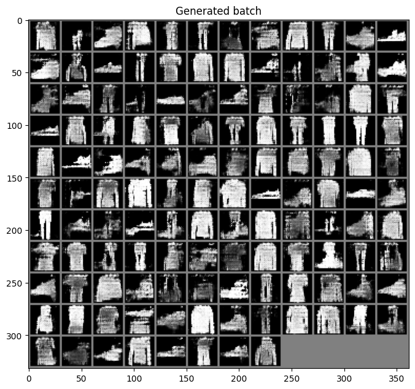
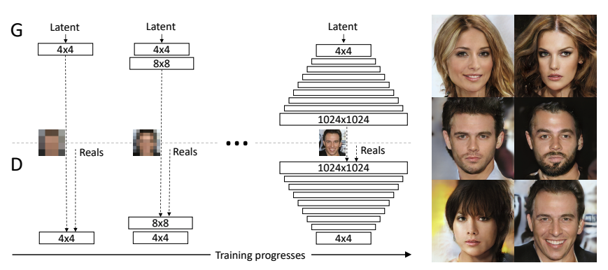
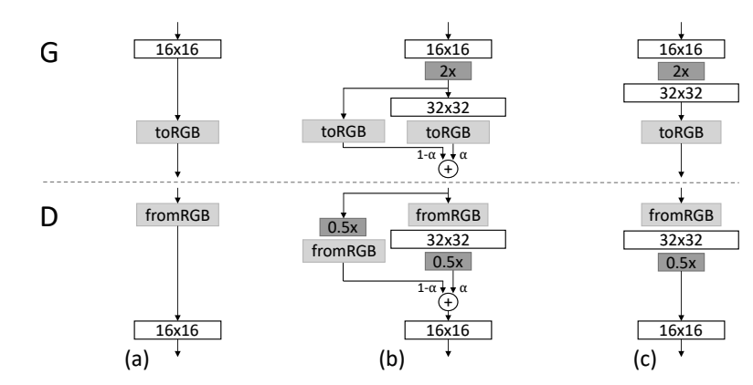
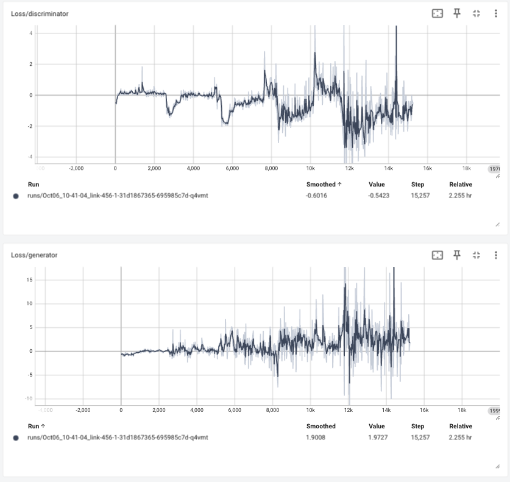
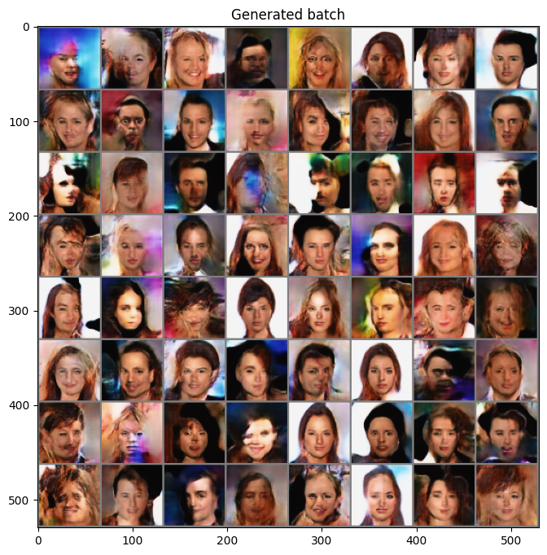

# Progressive GAN

import CodeDescription from "@site/src/components/CodeDescription";
import BrowserWindow from "@site/src/components/BrowserWindow";

이번 페이지에서는 Progressive 방법을 통해서 고해상도 GAN 모델의 학습 안정성흘 확보한 PGGAN(PROGRESSIVE GROWING OF GAN) 모델을 이용해 생성형 모델을 학습하는 방법에 대해서 설명합니다.

## Dataset

우선 튜토리얼에 들어가기에 앞서 사용할 데이터셋을 선언합니다.
데이터셋에 대한 자세한 설명은 [CelebA](../dataset/celeba) 페이지에서 확인할 수 있습니다.

```python showLineNumbers
import torchvision.transforms as T
import numpy as np
import matplotlib.pyplot as plt
from torchvision.datasets.celeba import CelebA
from torch.utils.data import DataLoader
from torchvision.utils import make_grid


transform = T.Compose(
    [
        T.Resize(64),
        T.CenterCrop(64),
        T.ToTensor(),
        T.Normalize((0.5, 0.5, 0.5), (0.5, 0.5, 0.5)),
    ]
)
dataset = CelebA(
    "./datasets", download=True, transform=transform
)
loader = DataLoader(dataset, batch_size=64, shuffle=True, drop_last=True)
```

## Paper

논문에서는 기존의 GAN 모델의 한계점을 다음과 같이 지적합니다.

> Autoregressive models – such as PixelCNN – produce sharp images but are slow to evaluate and do not have a latent representation as they directly model the conditional distribution over pixels, potentially limiting their applicability.



GAN 모델이 이미지를 생성할 때 위의 예시처럼 날카롭게 (Sharpening) 만드는 현상이 있습니다.


<CodeDescription>
논문에서는 이러한 현상을 없애기 위해서 다음과 같은 학습 방법을 제시합니다.



The key idea is to grow both the generator and discriminator progressively: starting from a low resolution, we add new layers that model increasingly fine details as training progresses.
This both speeds the training up and greatly stabilizes it, allowing us to produce images of unprecedented quality.

Our primary contribution is a training methodology for GANs where we start with low-resolution
images, and then progressively increase the resolution by adding layers to the networks as visualized
in Figure 1.

This incremental nature allows the training to first discover large-scale structure of the
image distribution and then shift attention to increasingly finer scale detail, instead of having to learn
all scales simultaneously.

</CodeDescription>

모델을 학습할 때 있어서 전체 레이어를 한 번에 학습하는 것이 아니라 낮은 해상도를 생성하는 모델에서 부터 높은 해상도 모델을 학습하는 방법으로 이러한 문제의 해결법을 제시합니다.
해당 페이지에서는 이러한 학습 방법을 수행할 수 있는 코드를 작성해 봅니다.

다만 논문에서 하려는 1024x1024 의 고해상도 이미지를 생성하기 위해서 생성기와 분류기에 많은 학습 안정화 기법들을 포함하고 있습니다.
그래서 이전 모델들과 다르게 이러한 부분들을 좀 더 상세하게 설명하겠습니다.


## Generator

<CodeDescription>

모델의 아키텍쳐를 위해서 논문에서 제시한 내용은 아래와 같습니다.

1. Our latent vectors correspond to random points on a 512-dimensional hypersphere, and we represent training and generated images in [-1,1]
2. We use leaky ReLU with leakiness 0.2 in all layers of both networks, except for the last layer that uses linear activation.
3. We do not employ batch normalization, layer normalization, or weight normalization in either network, but we perform pixelwise normalization of the feature vectors after each Conv 3×3 layer in the generator as described in Section 4.2
4. We initialize all bias parameters to zero and all weights according to the normal distribution with unit variance. However, we scale the weights with a layer-specific constant at runtime as described in Section 4.1
5. We inject the across-minibatch standard deviation as an additional feature map at 4 × 4 resolution toward the end of the discriminator as described in Section 3.
6. The upsampling and downsampling operations in Table 2 correspond to 2 × 2 element replication and average pooling, respectively.

</CodeDescription>

논문에서 제시한 것과 같이 생성기를 생성할 때는 아래 항목을 이용합니다.

1. latent space 의 512 dimension 을 기준으로 확장합니다.
2. 0.2 기울기의 LeakyReLU 를 사용합니다.
3. Pixel Normalization 을 적용합니다.
4. bias 를 0으로 variance 를 1로 초기화합니다.
5. nearest neighbor upsampling 과 average pooling downsampling 을 사용합니다.

### Conv Layer

구현에 앞서 각 내용들을 확인하는 코드를 작성합니다.

> 1. latent space 의 512 dimension 을 기준으로 확장합니다.

512 사이즈를 갖는 random noise 를 선언합니다.

```python showLineNumbers
import torch
import torch.nn as nn


z = torch.randn(1, 512, 1, 1)
```

첫 번째 블록에서는 4x4, 3x3 Conv 레이어를 이용합니다.
그리고 각 레이어의 출력은 (512x4x4) 이여야 합니다.

이를 위해서는 4x4 conv 레이어의 파라미터는 `stride=1, padding=0` 로 입력합니다.

<BrowserWindow>
```python showLineNumbers
layer_1_conv_1 = nn.ConvTranspose2d(512, 512, 4, 1, 0)
layer_1_conv_1(z).shape
```
```python
torch.Size([1, 512, 4, 4])
```
</BrowserWindow>

다음으로 3x3 은 `stride=1, padding=1` 로 입력합니다.

<BrowserWindow>
```python showLineNumbers
layer_1_conv_2 = nn.ConvTranspose2d(512, 512, 3, 1, 1)
layer_1_conv_2(layer_1_conv_1(z)).shape
```
```python
torch.Size([1, 512, 4, 4])
```
</BrowserWindow>

실행하면 같은 shape 인 것을 확인할 수 있습니다.

### Pixel Normalization

CNN 레이어를 지난 텐서값들을 정규화할 때 여타 다른 Normalization 기법과는 달리 Pixel Normalization 을 적용합니다.

> We normalize the feature vector in each pixel to unit length in the generator after each convolutional layer.

4.2 PIXELWISE FEATURE VECTOR NORMALIZATION IN GENERATOR 섹션에서 설명은 다음과 같습니다.

<CodeDescription>
> We normalize the feature vector in each pixel to unit length in the generator after each convolutional layer.
> We do this using a variant of “local response normalization” (Krizhevsky et al., 2012), configured as

$$
b_{x,y}=a_{x,y} / \sqrt{\frac{1}{N}\textstyle\sum^{N-1}_{j=0}{(a^{j}_{x,y})^{2}+\epsilon}} \text{, where } \epsilon=10^{-8}
$$

$N$ is the number of feature maps, and $a_{x,y}$ and $b_{x,y}$ are the original and normalized feature vector in pixel $(x, y)$, respectively

</CodeDescription>

위 내용의 구현 하고 결과물을 확인해 보겠습니다.

다음과 같은 텐서를 가지고 pixel normalization 을 수행해 보겠습니다.

<BrowserWindow>
```python showLineNumbers
raw = torch.Tensor([i for i in range(12)]).view(1, -1, 2, 2)
raw
```
```python
tensor([[[[ 0.,  1.],
          [ 2.,  3.]],

         [[ 4.,  5.],
          [ 6.,  7.]],

         [[ 8.,  9.],
          [10., 11.]]]])
```
</BrowserWindow>

위의 수식을 구현하기 위해서는 아래와 같은 코드를 사용할 수 있습니다.
<BrowserWindow>
```python showLineNumbers
raw / torch.sqrt(torch.mean(raw**2, dim=1, keepdim=True)+ 1e-8)
```
```python
tensor([[[[0.0000, 0.1674],
          [0.2928, 0.3884]],

         [[0.7746, 0.8372],
          [0.8783, 0.9062]],

         [[1.5492, 1.5070],
          [1.4639, 1.4241]]]])
```

</BrowserWindow>
실행하면 위와 같은 결과를 얻을 수 있습니다.

이제 해당 내용을 반영해 PixelNorm 모듈을 만들겠습니다.

```python showLineNumbers
class PixelNorm(nn.Module):
    def __init__(self, epsilon=1e-8):
        super().__init__()
        self.epsilon = epsilon

    def forward(self, x):
        return x / torch.norm(x, p=2, dim=1, keepdim=True).clamp(min=self.epsilon)
```

### Weight Initialization

CNN 레이어의 weight 들의 bias 를 0으로 variance 를 1로 초기화하며 graident 를 일정하게 하기 위한 기법을 적용합니다.

우선 초기 weight 를 초기화를 위해서 `nn.init` 을 사용합니다.

예를 들어서 아래와 같이 선언된 conv 레이어의 파라미터를 확인해 보겠습니다.

```python showLineNumbers
conv_1 = nn.ConvTranspose2d(512, 512, 4, 1, 0)
```

우선 bias 를 확인하면 0이 아닌 숫자들로 이루어져있습니다.

<BrowserWindow>
```python showLineNumbers
conv_1.bias[:10]
```
```python
tensor([ 0.0092, -0.0096, -0.0101,  0.0013,  0.0021, -0.0066,  0.0069, -0.0082,
        -0.0024,  0.0095], grad_fn=<SliceBackward0>)
```
</BrowserWindow>

이번에 weight의 평균과 분산을 확인 해 보겠습니다.

<BrowserWindow>
```python showLineNumbers
tmp_weight = next(conv_1.parameters())[0]
tmp_weight.mean(), tmp_weight.std()
```
```python
(tensor(2.8862e-06, grad_fn=<MeanBackward0>),
 tensor(0.0063, grad_fn=<StdBackward0>))
```
</BrowserWindow>

이제 이 conv 레이어의 bias 와 weight 를 초기화하겠습니다.

```python showLineNumbers
_ = nn.init.normal_(conv_1.weight)
_ = nn.init.zeros_(conv_1.bias)
```

초기화 후 값을 bias를 확인하면 다음과 같이 0으로 되어 있는 것을 확인할 수 있습니다.

<BrowserWindow>
```python showLineNumbers
conv_1.bias[:10]
```
```python
tensor([0., 0., 0., 0., 0., 0., 0., 0., 0., 0.], grad_fn=<SliceBackward0>)
```
</BrowserWindow>

다음으로 가중치를 확인하면 다음과 같이 평균이 0 분산이 1 이 된 것을 확인할 수 있습니다.

<BrowserWindow>
```python showLineNumbers
atmp_weight = next(conv_1.parameters())
tmp_weight.mean(), tmp_weight.std()
```
```python
(tensor(-0.0001, grad_fn=<MeanBackward0>),
 tensor(1.0000, grad_fn=<StdBackward0>))
 ```
</BrowserWindow>

### Upsampling Layer

두 번째 레이어부터는 Upsample 을 이용해 512x8x8 을 만들어주야 합니다.
이 때 Upsampling 방법은 위에 언급한 것 처럼 nearest neigbor pooling 을 사용합니다.

예를 들어서 다음과 같은 tensor가 있습니다.

<BrowserWindow>
```python showLineNumbers
low = torch.Tensor([i for i in range(4)]*3).view(1, -1, 2, 2)
low
```
```python
tensor([[[[0., 1.],
          [2., 3.]],

         [[0., 1.],
          [2., 3.]],

         [[0., 1.],
          [2., 3.]]]])

```
</BrowserWindow>

이제 이 텐서를 2배로 키우게 되면 사이의 값들이 비게 됩니다.
이 값을 채우기 위한 여러 방법 중 nearest 를 이용해 채웁니다.
그러면 다음과 같은 tensor 를 얻을 수 있습니다.

<BrowserWindow>
```python showLineNumbers
near_pool = nn.Upsample(scale_factor=2, mode="nearest")
high = near_pool(low)
high
```
```python
tensor([[[[0., 0., 1., 1.],
          [0., 0., 1., 1.],
          [2., 2., 3., 3.],
          [2., 2., 3., 3.]],

         [[0., 0., 1., 1.],
          [0., 0., 1., 1.],
          [2., 2., 3., 3.],
          [2., 2., 3., 3.]],

         [[0., 0., 1., 1.],
          [0., 0., 1., 1.],
          [2., 2., 3., 3.],
          [2., 2., 3., 3.]]]])
```

</BrowserWindow>

### Equalized Learning Rate

<CodeDescription>
4.1 EQUALIZED LEARNING RATE 에서 설명하는 내용은 다음과 같습니다.

To be precise, we set $\hat{w}^{i} = w_{i}/c$, where $w_{i}$ are the weights and $c$ is the per-layer normalization constant from He's initializer (He et al., 2015).
</CodeDescription>

이를 위해서는 다음과 같이 레이어의 forward를 수정해주어야 합니다.
- 기존: $pixel * (weight * \frac{1}{norm})$
- 변경: $(pixel * \frac{1}{norm}) * weight$

이 때 norm 은 weight 들의 크기로 계산되며 이를 위한 코드는 아래와 같습니다.

```python showLineNumbers
in_channels = 512
kernel_size = 4
scale = (2 / (in_channels * (kernel_size ** 2))) ** 0.5
```

기존에 CNN 을 수행하는 과정과 비교하기 위해 bias 를 따로 선언 후 계산을 하겠습니다.

```python showLineNumbers
conv_1 = nn.ConvTranspose2d(512, 512, 4, 1, 0)
bias = conv_1.bias
bias = bias.view(1, bias.size(0), 1, 1)
conv_1.bias = None
```

두 방법은 backward 과정에서 gradient 계산에서 수정이 생기게 하는 방법임으로 두 방법의 forward 결과는 같아야 합니다.

만약 CNN 이 동작하는 방법대로 수행하면 아래와 같습니다.
<BrowserWindow>
```python showLineNumbers
original_result = (conv_1(z) * scale) + bias
original_result[0][:5]
```
```python
tensor([[[-0.0101]],

        [[ 0.0016]],

        [[-0.0362]],

        [[-0.0351]],

        [[ 0.0174]]], grad_fn=<SliceBackward0>)

```
</BrowserWindow>

위의 내용으로 수정 한 결과는 아래와 같습니다.
<BrowserWindow>
```python showLineNumbers
fixed_result = conv_1(z * scale) + bias.view(1, bias.size(0), 1, 1)
fixed_result[0][:5]
```
```python
tensor([[[-0.0101]],

        [[ 0.0016]],

        [[-0.0362]],

        [[-0.0351]],

        [[ 0.0174]]], grad_fn=<SliceBackward0>)
```
</BrowserWindow>

두 결과가 같은 것을 확인할 수 있습니다.

이제 이 내용을 사용할 수 있는 수정된 Conv2d 클래스를 작성합니다.

```python showLineNumbers
class EqualizedLearningConv2d(nn.Module):
    def __init__(
        self, in_channels, out_channels, kernel_size=3, stride=1, padding=1
    ):
        super().__init__()
        self.conv = nn.Conv2d(in_channels, out_channels, kernel_size, stride, padding)
        self.scale = (2 / (in_channels * (kernel_size ** 2))) ** 0.5
        self.bias = self.conv.bias
        self.conv = nn.Conv2d(512, 512, 1, 1, 0)
        self.bias = self.conv.bias
        self.conv.bias = None

        nn.init.normal_(self.conv.weight)
        nn.init.zeros_(self.bias)

    def forward(self, x):
        return self.conv(x * self.scale) + self.bias.view(1, self.bias.size(0), 1, 1)
```
### Generator Block

위에서 설명한 내용을 반영해서 Generator 에서 사용할 Block 을 선언합니다.

```python showLineNumbers
class GeneratorBlock(nn.Module):
    def __init__(self, in_channel, out_channel):
        super().__init__()
        self.near_pooling = nn.Upsample(scale_factor=2, mode="nearest")
        self.conv_1 = EqualizedLearningConvTranspose2d(in_channel, out_channel, 3, 1, 1)
        self.pixel_norm_1 = PixelNorm()
        self.act_1 =  nn.LeakyReLU(0.2, inplace=True)
        self.conv_2 = EqualizedLearningConvTranspose2d(out_channel, out_channel, 3, 1, 1)
        self.act_2 =  nn.LeakyReLU(0.2, inplace=True)
        self.pixel_norm_2 = PixelNorm()

    def forward(self, x):
        x_up = self.near_pooling(x)
        x_out_1 = self.act_1(self.pixel_norm_1(self.conv_1(x_up)))
        x_out_2 = self.act_2(self.pixel_norm_2(self.conv_2(x_out_1)))
        return x_out_2
```

### FadeIn - ToRGB

<CodeDescription>

저 해상도의 학습이 끝나고 다음 해상도로 넘어갈 때 모델의 큰 충격이 가해지는 것을 방지하기 위해서 논문에서는 아래 내용을 제시합니다.


When new layers are added to the networks, we fade them in smoothly, as illustrated in Figure 2.
This avoids sudden shocks to the already well-trained, smaller-resolution layers.

When doubling the resolution of the generator (G) and discriminator (D) we fade in the
new layers smoothly. This example illustrates the transition from 16 × 16 images (a) to 32 × 32
images (c). During the transition (b) we treat the layers that operate on the higher resolution like a
residual block, whose weight α increases linearly from 0 to 1. Here 2× and 0.5× refer to doubling
and halving the image resolution using nearest neighbor filtering and average pooling, respectively.
The toRGB represents a layer that projects feature vectors to RGB colors and fromRGB does
the reverse; both use 1 × 1 convolutions. When training the discriminator, we feed in real images
that are downscaled to match the current resolution of the network. During a resolution transition,
we interpolate between two resolutions of the real images, similarly to how the generator output
combines two resolutions
</CodeDescription>

즉 conv layer 를 통과한 데이터를 3채널의 RGB 로 바꿔주는 레이어가 필요합니다.
이 레이어는 1x1 Conv 로 구성되야 하며 넓이와 높이는 유지하되 채널만 바꿔야 합니다.
위에서 작성한 `EqualizedLearningConvTranspose2d` 클래스에 `kernel_size=1, stride=1, padding=0` 을 주어서 생성합니다.

```python showLineNumbers
to_rgb = EqualizedLearningConvTranspose2d(512, 3, kernel_size=1, stride=1, padding=0)
```

이 레이어가 정상적으로 동작하는지 확인합니다.

<BrowserWindow>
```python showLineNumbers
z.shape, to_rgb(z).shape
```
```python
(torch.Size([1, 512, 1, 1]), torch.Size([1, 512, 1, 1]))
```
</BrowserWindow>

latent 에서는 사이즈가 유지되는 것을 확인했습니다.

다음으로 생성기의 첫번째 레이어를 작성하고 실험해 보겠습니다.

<BrowserWindow>
```python showLineNumbers
layer_1 = nn.Sequential(
    nn.ConvTranspose2d(512, 512, 4, 1, 0),
    nn.LeakyReLU(0.2, inplace=True),
    nn.ConvTranspose2d(512, 512, 3, 1, 1),
    nn.LeakyReLU(0.2, inplace=True),
)
layer_1_out = layer_1(z)
layer_1_out.shape, to_rgb(layer_1_out).shape
```
```python
(torch.Size([1, 512, 4, 4]), torch.Size([1, 512, 4, 4]))
```
</BrowserWindow>

이번에도 사이즈가 유지되었습니다.

실제로 모델에 적용될 때는 alpha 값을 통해서 적절한 비율로 합쳐지게 됩니다.

### Class Generator 

작성할 모델의 아키텍쳐는 논문에서 제시한 형태를 따라갑니다. 튜토리얼에서는 CelebA 데이터의 64x64 까지만 작성합니다.


이를 전체 구성으로 그리면 다음과 같습니다.


[출처: https://towardsdatascience.com/progan-how-nvidia-generated-images-of-unprecedented-quality-51c98ec2cbd2]

<CodeDescription>
```python showLineNumbers
class Generator(nn.Module):
    def __init__(self):
        super().__init__()

        self.latent_normalizer = PixelNorm()
        self.up_sampler = nn.Upsample(scale_factor=2, mode="nearest")
        self.layer_1 = nn.Sequential(
            nn.ConvTranspose2d(512, 512, 4, 1, 0),
            nn.LeakyReLU(0.2, inplace=True),
            EqualizedLearningConv2d(512, 512, 3, 1, 1),
            nn.LeakyReLU(0.2, inplace=True),
            PixelNorm(),
        )
        self.layers = nn.ModuleList([])
        self.rgb_layers = nn.ModuleList([EqualizedLearningConv2d(512, 3, 1, 1, 0)])
        for layer_num in range(2, 6):
            # add layer
            self.layers += [GeneratorBlock(512, 512)]
            self.rgb_layers += [EqualizedLearningConv2d(512, 3, 1, 1, 0)]

        self.last_layer = nn.Tanh()

    def forward(self, z, alpha, step):
        # first layer
        normalized_z = self.latent_normalizer(z)
        layer_out = self.layer_1(normalized_z)

        # middle layers
        for layer_num in range(1, step):
            up_out = self.up_sampler(layer_out)
            layer_out = self.layers[layer_num - 1](up_out)

        # transform to rgb
        layer_out = self.rgb_layers[step - 1](layer_out)

        # fade in
        if alpha < 1.0 and step > 1:
            fade_out = self.rgb_layers[step - 2](up_out)
            layer_out = alpha * layer_out + (1 - alpha) * fade_out

        # 0~1 scaling
        final_out = self.last_layer(layer_out)
        return final_out
```

생성기에서 처리해야 하는 데이터 방식은 아래와 같습니다.


Step 이 1 일 때, 즉 최초의 레이어를 학습 할 때의 동작 방식은 다음과 같습니다.
```python {5-11,17,25,33}
class Generator(nn.Module):
    def __init__(self):
        super().__init__()

        self.layer_1 = nn.Sequential(
            nn.ConvTranspose2d(512, 512, 4, 1, 0),
            nn.LeakyReLU(0.2, inplace=True),
            EqualizedLearningConv2d(512, 512, 3, 1, 1),
            nn.LeakyReLU(0.2, inplace=True),
            PixelNorm(),
        )
        ...
        self.last_layer = nn.Tanh()

    def forward(self, z, alpha, step):
        # first layer
        layer_out = self.layer_1(z)  # (N, 512, 4, 4)

        # middle layers
        for layer_num in range(1, step):
            up_out = self.up_sampler(layer_out)
            layer_out = self.layers[layer_num - 1](up_out)

        # transform to rgb
        layer_out = self.rgb_layers[step - 1](layer_out)

        # fade in
        if alpha < 1.0 and step > 1:
            fade_out = self.rgb_layers[step - 2](up_out)
            layer_out = alpha * layer_out + (1 - alpha) * fade_out

        # 0~1 scaling
        final_out = self.last_layer(layer_out)
        return final_out
```
1. 최초의 latent (N, 512, 1, 1) 데이터는 첫 번째 layer_1 를 통해서 4x4 데이터로 upscale 됩니다.
2. upscale 이후에는 rgb layer 를 통해서 채널을 3으로 변경합니다.
3. 이 때는 `ConvTranspose2d` 를 이용함으로 fade in 알고리즘을 적용하지 않습니다.
4. 이후 tanh 를 통해서 0~1 사이의 값으로 변환합니다.

두 번째 레이어 이후 부터는 다음과 같습니다.
```python {13-18,24,27-29,32,40}
class Generator(nn.Module):
    def __init__(self):
        super().__init__()

        self.up_sampler = nn.Upsample(scale_factor=2, mode="nearest")
        self.layer_1 = nn.Sequential(
            nn.ConvTranspose2d(512, 512, 4, 1, 0),
            nn.LeakyReLU(0.2, inplace=True),
            EqualizedLearningConv2d(512, 512, 3, 1, 1),
            nn.LeakyReLU(0.2, inplace=True),
            PixelNorm(),
        )
        self.layers = nn.ModuleList([])
        self.rgb_layers = nn.ModuleList([EqualizedLearningConv2d(512, 3, 1, 1, 0)])
        for layer_num in range(2, 6):
            # add layer
            self.layers += [GeneratorBlock(512, 512)]
            self.rgb_layers += [EqualizedLearningConv2d(512, 3, 1, 1, 0)]

        self.last_layer = nn.Tanh()

    def forward(self, z, alpha, step):
        # first layer
        layer_out = self.layer_1(z)  # (N, 512, 4, 4)

        # middle layers
        for layer_num in range(1, step):
            up_out = self.up_sampler(layer_out)
            layer_out = self.layers[layer_num - 1](up_out)

        # transform to rgb
        layer_out = self.rgb_layers[step - 1](layer_out)

        # fade in
        if alpha < 1.0 and step > 1:
            fade_out = self.rgb_layers[step - 2](up_out)
            layer_out = alpha * layer_out + (1 - alpha) * fade_out

        # 0~1 scaling
        final_out = self.last_layer(layer_out)
        return final_out
```
1. 최초의 latent (N, 512, 1, 1) 데이터는 첫 번째 layer_1 를 통해서 4x4 데이터로 upscale 됩니다.
2. Upscaling 이 된 값들은 conv layer 를 각 step 별로 수행합니다. 이를 통해서 레이어를 한 번 지날 때마다 2배씩 커집니다.
3. 해당 레이어에 맞는 즉 feature dimension 이 동일한 rgb layer 를 찾아서 채널을 3으로 변경합니다.
4. 이후 tanh 를 통해서 0~1 사이의 값으로 변환합니다

만약 초기에 fade in 을 적용해야 하는 경우에는 다음과 같이 동작합니다.

```python {12,19-21}
class Generator(nn.Module):
    def __init__(self):
        super().__init__()
        ...

    def forward(self, z, alpha, step):
        # first layer
        layer_out = self.layer_1(z)  # (N, 512, 4, 4)

        # middle layers
        for layer_num in range(1, step):
            up_out = self.up_sampler(layer_out)
            layer_out = self.layers[layer_num - 1](up_out)

        # transform to rgb
        layer_out = self.rgb_layers[step - 1](layer_out)

        # fade in
        if alpha < 1.0 and step > 1:
            fade_out = self.rgb_layers[step - 2](up_out)
            layer_out = alpha * layer_out + (1 - alpha) * fade_out

        # 0~1 scaling
        final_out = self.last_layer(layer_out)
        return final_out
```

중간 레이어를 통과시킨 이후에는 두 개의 값이 나옵니다.
1. upscaling 된 값 : N, 512, 8, 8
2. upscaling 된 후 conv 를 통과한 값 : N, 512, 8, 8

1 --> 이 중 2번의 값이 해당 레이어의 rgb layer를 통과해 N, 512, 16, 16 이 됩니다.  
2 --> fade in 을 위해서 1번의 값을 conv 를 통과하지 않고 이 전의 rgb layer 에 통과시키면 동일하게 N, 512, 16, 16 이 됩니다.

이 후 두 값을 주어진 alpha 값에 맞춰서 더하면 됩니다.
</CodeDescription>


#### Execution

이번에는 생성기의 내부 코드가 어떻게 동작하는 지 확인해 보도록 하겠습니다.

<CodeDescription>
```python showLineNumbers
generator = Generator()

z = torch.rand(1, 512, 1, 1)  # (N, 512, 1, 1)
alpha = 0.5
step = 2

with torch.no_grad():
    # first layer
    layer_out = generator.layer_1(z)  # (N, 512, 4, 4)

    # middle layers
    for layer_num in range(1, step):  # one loop
        up_out = generator.up_sampler(layer_out)  # (N, 512, 8, 8)
        layer_out = generator.layers[layer_num - 1](up_out)  # (N, 512, 8, 8)

    # transform to rgb
    layer_out = generator.rgb_layers[step - 1](layer_out)  # (N, 3, 8, 8)

    # fade in
    if alpha < 1.0 and step > 1:  # (N, 3, 8, 8)
        fade_out = generator.rgb_layers[step - 2](up_out)  # (N, 3, 8, 8)
        layer_out = alpha * layer_out + (1 - alpha) * fade_out  # (N, 3, 8, 8)

    final_out = generator.last_layer(layer_out)  # (N)
```

- 생성기의 입력값 `z`은 생성할 이미지들의 정보가 있는 latent space 에서 추출한 값입니다.
- 최초 layer 를 통과한 후 데이터는 ConvTranspose2d 를 통해서 (N, 512, 4, 4) 가 됩니다.
- 두 번째 레이어 부터는 upscale 이 된 후 conv layer 를 통과합니다.
    - 여기서는 step 이 2 이기 때문에 한 번 upscale 되어서 (N, 512, 8, 8) 이 됩니다.
- conv 레이어를 통과한 값은 rgb layer 를 통해서 3개의 채널로 변환되어 (N, 3, 8, 8) 를 갖습니다.
- alpha 가 1 보다 작기 때문에 fade 데이터를 생성 후 최종 layer_out 을 만듭니다.
</CodeDescription>

이번에는 모든 step 에 대해서 정상적으로 동작하는 지 확인합니다.

<BrowserWindow>
```python showLineNumbers
with torch.no_grad():
    for step in range(1, 6):
        out = generator(z, alpha=0.5, step=step)
        print(f"Step - {step} shape :", out.shape)
```
```python
Step - 1 shape : torch.Size([1, 3, 4, 4])
Step - 2 shape : torch.Size([1, 3, 8, 8])
Step - 3 shape : torch.Size([1, 3, 16, 16])
Step - 4 shape : torch.Size([1, 3, 32, 32])
Step - 5 shape : torch.Size([1, 3, 64, 64])
```
</BrowserWindow>

## Discriminator

### Discriminator Block

```python showLineNumbers
class DiscriminatorBlock(nn.Module):
    def __init__(self, in_channel, out_channel):
        super().__init__()
        self.conv_1 = EqualizedLearningConv2d(in_channel, out_channel, 3, 1, 1)
        self.act_1 = nn.LeakyReLU(0.2, inplace=True)
        self.conv_2 = EqualizedLearningConv2d(out_channel, out_channel, 3, 1, 1)
        self.act_2 = nn.LeakyReLU(0.2, inplace=True)

    def forward(self, x):
        x_out_1 = self.act_1(self.conv_1(x))
        x_out_2 = self.act_2(self.conv_2(x_out_1))
        return x_out_2
```


<CodeDescription>
We do not employ batch normalization, layer normalization, or weight normalization in either network, 
but we perform pixelwise normalization of the feature vectors after each Conv 3×3 layer in the generator as described in Section 4.2.
</CodeDescription>

논문에서 제시한 것과 같게 분류기의 블록에서는 생성기의 블록과 다르게 normalization 기법을 사용하지 않습니다.

### Last layer

PGGAN 의 학습은 앞서 WGAN 에서 사용한 Wasserstein Distance 를 이용합니다.
그렇기 때문에 Discriminator 의 마지막 레이어의 출력 또한 linear 입니다.

마지막 레이어가 받는 텐서의 타입은 항상 4x4 입니다.
```python showLineNumbers
# last layer for discriminator
# input is 512 x 4 x 4 from generator
x = torch.randn(2, 512, 4, 4)
```

이를 위해서 아래와 같은 레이어를 구성해서 거리를 계산할 수 있습니다.
<BrowserWindow>
```python showLineNumbers
# last layer for Wasserstein distance
last_layer = nn.Sequential(
    EqualizedLearningConv2d(512, 512, 3, 1, 1),
    nn.LeakyReLU(0.2, inplace=True),
    EqualizedLearningConv2d(512, 512, 4, 1, 0),
    nn.LeakyReLU(0.2, inplace=True),
    EqualizedLearningConv2d(512, 1, 1, 1, 0),
)
out = last_layer(x).squeeze()
out.shape
```
```python
torch.Size([2])

```
</BrowserWindow>

### Downsample

이미지 크기를 줄이기 위한 방법으로는 average pooling 을 이용합니다.
이미지의 크기를 줄이는 부분은 2 번째 블록을 통과할 때 이루어집니다.

예를 들어서 아래와 같은 텐서가 있습니다.

```python showLineNumbers
# down scale is used when step is greater than 2
# let's assume x is 8x8
x = torch.randn(2, 3, 8, 8)
```

이 이미지를 avg pooling 을 통해서 4x4 로 줄입니다.
<BrowserWindow>
```python showLineNumbers
# for fade in process use average pool to downscale
avg_pooler = nn.AvgPool2d(2, 2)
down_out = avg_pooler(x)
down_out.shape
```
```python
torch.Size([2, 3, 4, 4])
```
</BrowserWindow>
```
# convert this rgb to latent that is used before step
rgb_z = rgb_layer(down_out)
rgb_z.shape
```

### Fade in - FromRGB


생성기에서 수행한 것과 마찬가지로 분류기도 새로운 레이어가 추가될 때 충격을 최소화하기 위한 기법이 적용되어 있습니다.
다만 생성기에서 쉽게 했던 것과 다르게 복잡한 부분이 있어서 이를 설명하고자 합니다.

위의 이미지에서 (b) 의 D 부분을 수행하는 과정입니다.

분류기가 받는 RGB 를 fade 하기 위해서는 역시 두 방법이 필요합니다.

1. RGB -> fromRGb -> Conv2d -> downscale
2. RGB -> downscale -> fromRGB

아래는 이를 수행하는 과정입니다.

예를 들어서 2 번째 스텝을 수행하는 중이라고 가정해 (N, 3, 8, 8) 텐서를 만듭니다.
```python showLineNumbers
# When layer is added we should fade in not to shock before layers
# let's assume we trained 4x4 image and now we added layer to train 8x8 image
x = torch.randn(2, 3, 8, 8)
```

1번의 과정을 먼저 설명하겠습니다.
우선, 3채널의 이미지를 latent 로 바꾸기 위한 레이어가 필요합니다.
논문에서는 1024 지만 본 튜토리얼에서는 64x64 의 차원인 512를 사용합니다.

<BrowserWindow>
```python showLineNumbers
# first, feed with new from RGB layer
new_rgb_layer = EqualizedLearningConv2d(3, 512, 1, 1, 0)
new_z = new_rgb_layer(x)
new_z.shape
```
```python
torch.Size([2, 512, 8, 8])
```
</BrowserWindow>

이제 이 latent 를 Conv 레이어에 통과를 합니다.

<BrowserWindow>
```python showLineNumbers
# and feed to conv layer
new_conv_layer = DiscriminatorBlock(512, 512)
new_conv_out = new_conv_layer(new_z)
new_conv_out.shape
```
```python
torch.Size([2, 512, 8, 8])
```
</BrowserWindow>

Conv 를 통해서 나온 결과를 downscaling 을 통해서 4x4 로 축소합니다.
<BrowserWindow>
```python showLineNumbers
# last, downscale with avg_pool
avg_pool = nn.AvgPool2d(2, 2)
new_down_out = avg_pool(new_conv_out)
new_down_out.shape
```
```python
torch.Size([2, 512, 4, 4])
```
</BrowserWindow>

이제 2번의 방법을 수행합니다.

우선 들어온 x 를 downscale 을 해서 축소합니다. 이미지를 그대로 축소하기 때문에 (N, 3, 4, 4) 가 됩니다.

<BrowserWindow>
```python showLineNumbers
# Now, feed with before RGB layer
# First, down scale with avg_pool
before_down_out = avg_pool(x)
before_down_out.shape
```
```python
torch.Size([2, 3, 4, 4])
```
</BrowserWindow>

다음으로 이 전 rgb layer 를 이용해 feature 로 변경합니다.

<BrowserWindow>
```python showLineNumbers
# next feed before rgb layer
before_rgb_layer = EqualizedLearningConv2d(3, 512, 1, 1, 0)
before_out = before_rgb_layer(before_down_out)
before_out.shape
```
```python
torch.Size([2, 512, 4, 4])
```
</BrowserWindow>

마지막으로 위에서 계산된 1번과 2번을 주어진 alpha 값으로 계산합니다.
<BrowserWindow>
```python showLineNumbers

# and add both out with given alpha term
alpha = 0.5
final_out = alpha * new_down_out + (1 - alpha) * (before_out)
final_out.shape
```
```python
torch.Size([2, 512, 4, 4])
```
</BrowserWindow>

마지막으로 위에서 선언한 last_layer 를 통과시켜서 distance 로 변경합니다.
<BrowserWindow>
```python showLineNumbers
# and feed this with last layer
final_last_out = last_layer(final_out).squeeze()
final_last_out.shape
```
```python
torch.Size([2])
```
</BrowserWindow>

### Minibatch Stddev

학습을 안정화 시키기 위한 기법으로 "minibatch discrimination" 를 적용합니다.

이를 위해서 새로운 학습 파라미터를 적용하기 보다는 논문에서는 아래와 같은 방법을 제시합니다.
<CodeDescription>
**3 INCREASING VARIATION USING MINIBATCH STANDARD DEVIATION**

Our simplified solution has neither learnable parameters nor new hyperparameters.
1. We first compute the standard deviation for each feature in each spatial location over the minibatch.
2. We then average these estimates over all features and spatial locations to arrive at a single value.
3. We replicate the value and concatenate it to all spatial locations and over the minibatch, yielding one additional (constant) feature map.
4. This layer could be inserted anywhere in the discriminator, but we have found it best to insert it towards the end (see Appendix A.1 for details).
</CodeDescription>

이를 구현하면 아래와 같습니다.

```python showLineNumbers
def minibatch_stddev(x):  ## NxCxHxW -> N -> 1 -> Nx1xHxW
    batch_statistics = (
        torch.std(x, dim=0).mean().repeat(x.size(0), 1, x.size(2), x.size(3))
    )
    # we take the std for each example (across all channels, and pixels) then we repeat it
    # for a single channel and concatenate it with the image. In this way the discriminator
    # will get information about the variation in the batch/image
    return torch.cat([x, batch_statistics], dim=1)
```

### Class Discirminator

논문에서 제시한 discriminator 의 구조는 다음과 같습니다.


이를 전체 구성으로 그리면 다음과 같습니다.


[출처: https://towardsdatascience.com/progan-how-nvidia-generated-images-of-unprecedented-quality-51c98ec2cbd2]

```python showLineNumbers
class Discriminator(nn.Module):
    def __init__(self):
        super().__init__()

        self.avg_sampler = nn.AvgPool2d(2, 2)
        self.last_layer = nn.Sequential(
            EqualizedLearningConv2d(513, 512, 3, 1, 1),
            nn.LeakyReLU(0.2, inplace=True),
            EqualizedLearningConv2d(512, 512, 4, 1, 0),
            nn.LeakyReLU(0.2, inplace=True),
            EqualizedLearningConv2d(512, 1, 1, 1, 0),
        )
        self.rgb_layers = nn.ModuleList([EqualizedLearningConv2d(3, 512, 1, 1, 0)])
        self.layers = nn.ModuleList([DiscriminatorBlock(512, 512)])
        for layer_num in range(2, 6):
            # add layer
            self.layers += [DiscriminatorBlock(512, 512)]
            self.rgb_layers += [EqualizedLearningConv2d(3, 512, 1, 1, 0)]

    def forward(self, x, alpha, step):
        # feed initial
        layer_out = self.rgb_layers[step - 1](x)

        if step > 1:
            layer_out = self.layers[step - 1](layer_out)
            layer_out = self.avg_sampler(layer_out)

        # for fade in
        if alpha < 1.0 and step > 1:
            fade_out = self.avg_sampler(x)
            fade_out = self.rgb_layers[step - 2](fade_out)
            layer_out = (1 - alpha) * fade_out + alpha * layer_out

        # middle layers
        for layer_num in range(2, step):
            layer_out = self.layers[layer_num](layer_out)
            layer_out = self.avg_sampler(layer_out)

        # calculate stddev
        stddev_out = minibatch_stddev(layer_out)
        # last layer
        final_out = self.last_layer(stddev_out)
        return final_out.squeeze()
```

작성한 Discirminator 의 동작 방식을 확인합니다.

<CodeDescription>
```python showLineNumbers
discriminator = Discriminator()

x = torch.randn(2, 3, 16, 16)
alpha = 0.5
step = 3

with torch.no_grad():
    # feed initial
    layer_out = discriminator.rgb_layers[step - 1](x)  # (N, 512, 16, 16)
    if step > 1:
        layer_out = discriminator.layers[step - 1](layer_out)
        layer_out = discriminator.avg_sampler(layer_out)  # (N, 512, 8, 8)

    # for fade in
    if alpha < 1.0 and step > 1:
        fade_out = discriminator.avg_sampler(x)  # (N, 512, 8, 8)
        fade_out = discriminator.rgb_layers[step - 2](fade_out)  # (N, 512, 8, 8)
        layer_out = alpha * layer_out + (1 - alpha) * fade_out  # (N, 512, 8, 8)

    # middle layers
    for layer_num in range(2, step):
        layer_out = discriminator.layers[layer_num](layer_out)  # (N, 512, 8, 8)
        layer_out = discriminator.avg_sampler(layer_out)  # (N, 512, 4, 4)

    # calculate stddev
    stddev_out = minibatch_stddev(layer_out)  # (N, 513, 4, 4)
    # last layer
    final_out = discriminator.last_layer(stddev_out).squeeze()  #(N)
```
- 분류기의 입력값 `x`은 생성한 혹은 진짜 이미지들입니다.
    - 예제 데이터로 (N, 3, 16, 16)을 생성합니다.
- 최초 RGB 레이어를 통과해 feature 로 변환하면 (N, 512, 16, 16) 가 됩니다.
- step 이 2 이상인 경우 conv layer를 통과한 이후 downscale 이 되어서 (N, 512, 8, 8)가 됩니다.
- alpha 가 주어지면 fade 이미지를 생성합니다.
    - 이 때 값은 위에서 설명한 것 과 같이 x 입력을 down-scaling 한 이후 이줜 rgb 레이어를 통과합니다.
- 위에서 만든 fade 이미지를 이용해 conv 로 차원을 축소합니다.
- 마지막 레이어를 통해서 거리로 변환합니다.
</CodeDescription>

이번에는 모든 step 에 대해서 정상적으로 동작하는 지 확인합니다.

<BrowserWindow>
```python showLineNumbers
discriminator = Discriminator()

sizes = [4, 8, 16, 32, 64]
with torch.no_grad():
    for step in range(1, 6):
        x = torch.randn(2, 3, sizes[step-1], sizes[step-1])
        out = discriminator(x, alpha=0.5, step=step)
        print(f"Step - {step} shape :", out.shape)
```
```python
Step - 1 shape : torch.Size([2])
Step - 2 shape : torch.Size([2])
Step - 3 shape : torch.Size([2])
Step - 4 shape : torch.Size([2])
Step - 5 shape : torch.Size([2])
```
</BrowserWindow>

## Test

작성한 생성기와 분류기가 정상적으로 동작하는 지 확인합니다.
<BrowserWindow>
```python showLineNumbers
sizes = [4, 8, 16, 32, 64]

generator = Generator()
discriminator = Discriminator()
with torch.no_grad():
    z = torch.rand(2, 512, 1, 1)
    for step in range(1, 6):
        print(f"Step - {step} start")
        fake = generator(z, alpha=0.5, step=step)
        print(f"Generated data shape :", fake.shape)
        fake_out = discriminator(fake, alpha=0.5, step=step)
        print(f"Discriminated data shape :", fake_out.shape)
```
```python
sizes = [4, 8, 16, 32, 64]

generator = Generator()
discriminator = Discriminator()
with torch.no_grad():
    z = torch.rand(2, 512, 1, 1)
    for step in range(1, 6):
        print(f"Step - {step} start")
        fake = generator(z, alpha=0.5, step=step)
        print(f"Generated data shape :", fake.shape)
        fake_out = discriminator(fake, alpha=0.5, step=step)
        print(f"Discriminated data shape :", fake_out.shape)
```
</BrowserWindow>


## Train

### Device setting
device = torch.device("cuda" if torch.cuda.is_available() else "cpu")
device
_ = discriminator.to(device)
_ = generator.to(device)


Convolution Network 는 원활한 학습을 위해서는 gpu 가 필요합니다.
GPU 가 없는 경우 학습에 다소 시간이 소요될 수 있습니다.

아래 코드를 이용해 device 를 선언합니다.
만약 gpu 가 사용 가능한 경우 `device(type='cuda')` 메세지가 나옵니다.

<BrowserWindow>
```python showLineNumbers
device = torch.device("cuda" if torch.cuda.is_available() else "cpu")
device
```
```python
device(type='cuda')
```
</BrowserWindow>

위에서 선언한 모델을 gpu 메모리로 옮기겠습니다.

```python showLineNumbers
_ = discriminator.to(device)
_ = generator.to(device)
```

### Logger
학습 과정을 tensorboard 에 저장하기 위한 writer 입니다.

```python showLineNumbers
from torch.utils.tensorboard import SummaryWriter
# tensorboard logger
writer = SummaryWriter()
```

### Loss

PGGAn 은 WGAN-GP 에서는 사용한 loss term 을 사용하기 때문에 따로 선언하지 않습니다.

### Optimizer

논문에서는 제시하는 Adam 을 사용하며 learning_rate는 제시된 0.001, beta는 0.0, 0.99 를 사용합니다.

```python showLineNumbers
import torch.optim as optim

# optimizer
discriminator_opt = optim.Adam(discriminator.parameters(), lr= 0.001, betas=(0, 0.99))
generator_opt = optim.Adam(generator.parameters(), lr= 0.001, betas=(0, 0.99))
```

### Gradeint Penalty

WGAN-GP 와 같은 loss 를 사용하기 때문에 앞서 작성한 penalty 를 그대로 사용합니다.
다만 데이터 shape 이 expand 해주는 부분에 수정이 있었습니다.

또한 Discirminator 에서 alpha 와 step 이 필요하기 때문에 이 부분 또한 추가합니다.

```python showLineNumbers {3}
def compute_gradient_penalty(discriminator, real_data, fake_data, alpha, step):
    device = real_data.device
    beta = torch.rand(real_data.size(0), 1, 1, 1).to(device)
    beta = beta.expand(real_data.size())

    interpolates = beta * real_data + ((1 - beta) * fake_data)
    interpolates = interpolates.to(device)
    interpolates = torch.autograd.Variable(interpolates, requires_grad=True)

    disc_interpolates = discriminator(interpolates, alpha, step)
    grad_outputs = torch.ones(disc_interpolates.size(), requires_grad=False).to(device)
    gradients = torch.autograd.grad(
        outputs=disc_interpolates,
        inputs=interpolates,
        grad_outputs=grad_outputs,
        create_graph=True,
        retain_graph=True,
        only_inputs=True,
    )[0]
    gradients = gradients = gradients.view(gradients.size(0), -1)
    gradient_penalty = ((gradients.norm(2, dim=1) - 1) ** 2).mean()
    return gradient_penalty
```

### Fade Alpha

레이어가 늘었을 때 충격을 줄이기 위한 fade 부분에서 비율을 작성하는 부분입니다.
alpha 값은 선형적으로 학습 과정 중에 선형적으로 증가할 수 있도록 합니다.

실제 학습 과정에서는 아래 로직에 따라 증가합니다.

```python showLineNumbers
n_epochs = 1
alphas = []
alpha = 0
for epoch in range(n_epochs):
    for i in range(len(loader)):
        alpha +=  1/ (len(loader) * n_epochs)
        alphas += [alpha]
plt.plot(alphas)
```

### Code

학습하는 코드는 기본적을 WGAN-GP 을 따릅니다. 자세한 내용은 [WGAN-GP](./wgan-gp) 에서 확인하시면 됩니다.

<CodeDescription>
<BrowserWindow>
```python showLineNumbers
from tqdm import tqdm


# for meta
n_epochs = 1
n_progressive_epochs = 5
lambda_gp = 10
drift_eps = 0.001
image_sizes = [4, 8, 16, 32, 64]
batch_sizes = [64, 64, 64, 64, 32]

# for visualization
iteration = 0
fixed_z = torch.randn((64, 512, 1, 1)).to(device)

# for iteration history
G_loss_history = []
D_loss_history = []

# train code
for progressive_epoch in range(1, n_progressive_epochs + 1):
    alpha = 0.0
    size = image_sizes[progressive_epoch - 1]
    batch_size = batch_sizes[progressive_epoch - 1]
    loader = DataLoader(dataset, batch_size=batch_size, shuffle=True, drop_last=True)
    for epoch in range(n_epochs):
        epoch_G_loss = 0.0
        epoch_D_loss = 0.0

        for step, batch in enumerate(
            tqdm(loader, desc=f"Epoch {epoch + 1}/{n_epochs}")
        ):
            generator.train()
            discriminator.train()

            x = batch[0]
            x = T.Resize((size, size))(x)
            x = x.to(device)
            batch_size = x.size(0)
            #
            # 1. get discriminator loss and drift from real data 
            #
            discriminator_opt.zero_grad()
            real_D_score = discriminator(x, alpha, progressive_epoch)
            real_D_loss = real_D_score.mean()
            real_D_loss_drift = (real_D_score**2).mean()
            #
            # 2. get discriminator loss from fake data
            #
            z = torch.randn((batch_size, 512, 1, 1)).to(device)
            fake_data = generator(z, alpha, progressive_epoch)
            fake_D_score = discriminator(fake_data, alpha, progressive_epoch)
            fake_D_loss = fake_D_score.mean()
            #
            # 3. get penalty
            #
            gradient_penalty = compute_gradient_penalty(
                discriminator, x, fake_data, alpha, progressive_epoch
            )
            #
            # 4. get discriminator loss and update discriminator
            #
            D_loss = (
                -real_D_loss
                + fake_D_loss
                + lambda_gp * gradient_penalty
                + drift_eps * real_D_loss_drift
            )
            D_loss.backward()
            discriminator_opt.step()

            #
            # 5. get generator loss and update generator, n_critic is 1.
            #

            generator_opt.zero_grad()
            z = torch.randn((batch_size, 512, 1, 1)).to(device)
            generated_data = generator(z, alpha, progressive_epoch)
            generate_D_score = discriminator(generated_data, alpha, progressive_epoch)
            G_loss = -generate_D_score.mean()
            G_loss.backward()
            generator_opt.step()

            #
            # 6. update alpha
            #
            alpha +=  1/ (len(loader) * n_epochs)
            alpha = min(alpha, 1)

            # logging
            D_loss_history += [D_loss.item()]
            G_loss_history += [G_loss.item()]

            epoch_D_loss += D_loss.item() * len(x) / len(loader.dataset)
            epoch_G_loss += G_loss.item() * len(x) / len(loader.dataset)

            writer.add_scalar("Loss/discriminator", D_loss, iteration)
            writer.add_scalar("Loss/generator", G_loss, iteration)

            # iteration checkpoint
            if iteration % 2000 == 0:
                # visualization
                with torch.no_grad():
                    generated_x = generator(fixed_z, 1.0, progressive_epoch)
                    generated_x = generated_x.detach().cpu()
                    generated_x_grid = make_grid(generated_x, nrow=8).numpy()
                    generated_x_grid = (generated_x_grid * 0.5) + 0.5
                    generated_x_grid = np.transpose(generated_x_grid, (1, 2, 0))
                    plt.imsave(f"pggan-step-{iteration}.png", generated_x_grid)
            iteration += 1

        # last visualization
        with torch.no_grad():
            generated_x = generator(fixed_z, 1.0, progressive_epoch)
            generated_x = generated_x.detach().cpu()
            generated_x_grid = make_grid(generated_x, nrow=8).numpy()
            generated_x_grid = (generated_x_grid * 0.5) + 0.5
            generated_x_grid = np.transpose(generated_x_grid, (1, 2, 0))
            plt.imsave(f"pggan-step-{iteration}.png", generated_x_grid)
        log_string = f"Loss at epoch {epoch + 1} - D_loss : {epoch_D_loss:.4f}, G_loss : {epoch_G_loss:.4f}"
        print(log_string)
```
```python
Epoch 1/1: 100%|██████████| 2543/2543 [04:29<00:00,  9.44it/s]
Loss at epoch 1 - D_loss : 0.1417, G_loss : -0.1404
Epoch 1/1: 100%|██████████| 2543/2543 [05:22<00:00,  7.88it/s]
Loss at epoch 1 - D_loss : -0.1928, G_loss : 0.1629
Epoch 1/1: 100%|██████████| 2543/2543 [11:35<00:00,  3.66it/s]
Loss at epoch 1 - D_loss : -0.5816, G_loss : 1.0090
Epoch 1/1: 100%|██████████| 2543/2543 [26:09<00:00,  1.62it/s]
Loss at epoch 1 - D_loss : -0.7162, G_loss : 1.5299
Epoch 1/1: 100%|██████████| 5086/5086 [1:27:45<00:00,  1.04s/it]
Loss at epoch 1 - D_loss : -0.8887, G_loss : 2.7138
```
</BrowserWindow>

데이터 배치사이즈를 이미지 크기에 따라 조정합니다.
이 값은 학습하는 환경에 따라 바뀝니다.

```python {8,15}
# train code
# for meta
n_epochs = 1
n_progressive_epochs = 5
lambda_gp = 10
drift_eps = 0.001
image_sizes = [4, 8, 16, 32, 64]
batch_sizes = [64, 64, 64, 64, 32]

# train code
for progressive_epoch in range(1, n_progressive_epochs + 1):
    alpha = 0.0
    size = image_sizes[progressive_epoch - 1]
    batch_size = batch_sizes[progressive_epoch - 1]
    loader = DataLoader(dataset, batch_size=batch_size, shuffle=True, drop_last=True)
    for epoch in range(n_epochs):
        ...
        for step, batch in enumerate(
            tqdm(loader, desc=f"Epoch {epoch + 1}/{n_epochs}")
        ):
            ...
```

실제 이미지를 학습하는 레이어의 이미지 크기에 맞게 조정합니다.

```python {6,12,21-24}
# for meta
n_epochs = 1
n_progressive_epochs = 5
lambda_gp = 10
drift_eps = 0.001
image_sizes = [4, 8, 16, 32, 64]
batch_sizes = [64, 64, 64, 64, 32]

# train code
for progressive_epoch in range(1, n_progressive_epochs + 1):
    alpha = 0.0
    size = image_sizes[progressive_epoch - 1]
    batch_size = batch_sizes[progressive_epoch - 1]
    loader = DataLoader(dataset, batch_size=batch_size, shuffle=True, drop_last=True)
    for epoch in range(n_epochs):
        ...
        for step, batch in enumerate(
            tqdm(loader, desc=f"Epoch {epoch + 1}/{n_epochs}")
        ):
            ...
            x = batch[0]
            x = T.Resize((size, size))(x)
            x = x.to(device)
            batch_size = x.size(0)
            ...
```

discriminator 를 학습할 loss 를 생성합니다. 기존 WGAN-GP 다른 점은 drift가 추가되었습니다.
이때 drift 는 논문에서 제시한 0.001을 사용합니다.

```python {5,19,28}
# for meta
n_epochs = 1
n_progressive_epochs = 5
lambda_gp = 10
drift_eps = 0.001
image_sizes = [4, 8, 16, 32, 64]
batch_sizes = [64, 64, 64, 64, 32]

# train code
for progressive_epoch in range(1, n_progressive_epochs + 1):
    ...
    for epoch in range(n_epochs):
        ...
        for step, batch in enumerate(
            tqdm(loader, desc=f"Epoch {epoch + 1}/{n_epochs}")
        ):
            ...
            #
            # 1. get discriminator loss and drift from real data 
            #
            discriminator_opt.zero_grad()
            real_D_score = discriminator(x, alpha, progressive_epoch)
            real_D_loss = real_D_score.mean()
            real_D_loss_drift = (real_D_score**2).mean()
            ...
            #
            # 4. get discriminator loss and update discriminator
            #
            D_loss = (
                -real_D_loss
                + fake_D_loss
                + lambda_gp * gradient_penalty
                + drift_eps * real_D_loss_drift
            )
            D_loss.backward()
            discriminator_opt.step()
```

기존 WGAN-GP 에서 사용하던 n_critic 은 1로 설정하기 때문에 해당 부분을 삭제합니다.

```python {13-19}
# train code
for progressive_epoch in range(1, n_progressive_epochs + 1):
    ...
    for epoch in range(n_epochs):
        ...
        for step, batch in enumerate(
            tqdm(loader, desc=f"Epoch {epoch + 1}/{n_epochs}")
        ):
        ...
        #
        # 5. get generator loss and update generator, n_critic is 1.
        #
        generator_opt.zero_grad()
        z = torch.randn((batch_size, 512, 1, 1)).to(device)
        generated_data = generator(z, alpha, progressive_epoch)
        generate_D_score = discriminator(generated_data, alpha, progressive_epoch)
        G_loss = -generate_D_score.mean()
        G_loss.backward()
        generator_opt.step()
        ...
```


위에서 설명한 것과 같이 alpha 값을 업데이트 합니다.

```python {3,15-16}
# train code
for progressive_epoch in range(1, n_progressive_epochs + 1):
    alpha = 0.0
    size = image_sizes[progressive_epoch - 1]
    batch_size = batch_sizes[progressive_epoch - 1]
    loader = DataLoader(dataset, batch_size=batch_size, shuffle=True, drop_last=True)
    for epoch in range(n_epochs):
        for step, batch in enumerate(
            tqdm(loader, desc=f"Epoch {epoch + 1}/{n_epochs}")
        ):
            ...
            #
            # 6. update alpha
            #
            alpha +=  1/ (len(loader) * n_epochs)
            alpha = min(alpha, 1)
            ...
```
</CodeDescription>

### Train loss

Tensorboard 에 로깅된 학습 정보를 확인하면 다음과 같습니다.



### Visualize

학습을 하면서 생성기가 어떻게 이미지를 생성하는 지 확인해 보겠습니다.

<BrowserWindow>
```python showLineNumbers
import os

img_list = list(sorted(filter(lambda x: x.startswith("pggan-step"), os.listdir("."))))
step_filename = {}
for fname in filter(lambda x: x.startswith("pggan-step"), os.listdir(".")):
    key = int(fname.replace("pggan-step-", "").replace(".png", ""))
    step_filename[key] = fname

nrows = (len(img_list) // 3) + 1

fig, axes = plt.subplots(ncols=3, nrows=nrows, figsize=(5 * nrows, 15))
for idx, key in enumerate(sorted(step_filename)):
    fname = step_filename[key]
    array = plt.imread(fname)
    axes[idx // 3, idx % 3].imshow(array)
    axes[idx // 3, idx % 3].axis("off")
    axes[idx // 3, idx % 3].set_title(fname.replace(".png", ""))

plt.tight_layout()
```

</BrowserWindow>

## Generation

이번에는 학습한 모델의 디코더를 이용해 랜덤한 latent 값을 주었을 때 어떤 이미지를 생성하는 지 확인해 보겠습니다.
학습이 끝난 모델을 사용하기 위해서는 `eval()` 모드를 설정해주어야 합니다.

<BrowserWindow>
```python showLineNumbers
generator.eval()
with torch.no_grad():    
    random_z = torch.randn((64, latent_dim, 1, 1)).to(device)
    generated_x = generator(random_z)

generated_x_grid = make_grid(generated_x, nrow=8).cpu().numpy()
# make data range to 0~1
generated_x_grid = (generated_x_grid * 0.5) + 0.5
plt.figure(figsize=(8, 8))
plt.title("Generated batch")
plt.imshow(np.transpose(generated_x_grid, (1, 2, 0)))
```

</BrowserWindow>

## References

- https://arxiv.org/pdf/1710.10196
- https://github.com/tkarras/progressive_growing_of_gans
- https://www.kaggle.com/code/heonh0/pggan-progressive-growing-gan-pggan-pytorch/notebook
- https://towardsdatascience.com/progan-how-nvidia-generated-images-of-unprecedented-quality-51c98ec2cbd2
