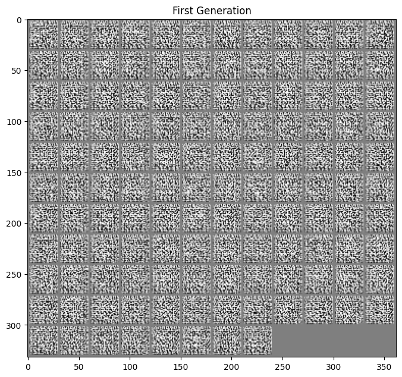
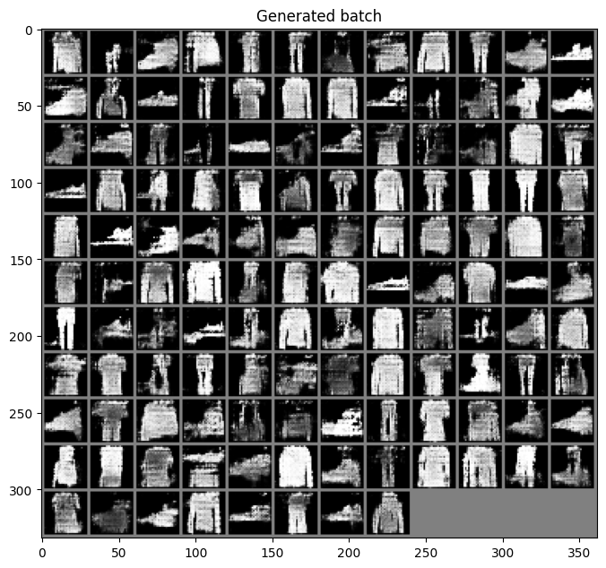

# VanilaGAN

import CodeDescription from "@site/src/components/CodeDescription";


이번 페이지에서는 GAN을 이용해 생성형 모델을 학습하는 방법에 대해서 설명합니다.

## Dataset
우선 튜토리얼에 들어가기에 앞서 사용할 데이터셋을 선언합니다.
데이터셋에 대한 자세한 설명은 [Fashion-MNIST](../dataset/fmnist) 페이지에서 확인할 수 있습니다.

```python
from torchvision.transforms import Compose, ToTensor, Lambda
from torchvision.datasets.mnist import FashionMNIST
from torch.utils.data import DataLoader

transform = Compose(
    [
        ToTensor(),
        Lambda(lambda x: (x - 0.5) * 2),
    ]
)
dataset = FashionMNIST("./datasets", download=True, train=True, transform=transform)
loader = DataLoader(dataset, batch_size=128, shuffle=True)
```

## GAN
이제 본격적으로 모델 코드를 작성해 보겠습니다.

GAN 에서는 분류기와 생성기 두 가지 모델을 학습해야 합니다.
이 때 학습하는 모델의 성능 (경험적으로 네트워크 크기와 관련)이 유사해야 적절하게 학습이 됩니다.
그래서 앞서 사용했던 예제 대신 좀 더 가벼운 모델을 이용하겠습니다.

### Discriminator

우선 분류에 사용할 모델에 대해 작성합니다.

```python
class Discriminator(nn.Module):
    def __init__(self):
        super().__init__()
        self.layer_1 = nn.Sequential(
            nn.Conv2d(1, 10, 4, 2, 1, bias=False),
            nn.BatchNorm2d(10),
            nn.LeakyReLU(0.2),
        )
        self.layer_2 = nn.Sequential(
            nn.Conv2d(10, 20, 4, 2, 1, bias=False),
            nn.BatchNorm2d(20),
            nn.LeakyReLU(0.2),
        )
        self.layer_3 = nn.Sequential(
            nn.Conv2d(20, 40, 4, 2, 1, bias=False),
            nn.BatchNorm2d(40),
            nn.LeakyReLU(0.2),
        )
        self.last_layer = nn.Sequential(
            nn.Conv2d(40, 1, 3, 1, 0, bias=False), nn.Sigmoid()
        )

    def forward(self, x):
        # encoding
        layer_1_out = self.layer_1(x)  # (N, 10, 14, 14)
        layer_2_out = self.layer_2(layer_1_out)  # (N, 20, 7, 7)
        layer_3_out = self.layer_3(layer_2_out)  # (N, 40, 3, 3)
        # classify
        out = self.last_layer(layer_3_out).squeeze()  # (N, 1)
        return out

```

분류기의 내부 코드가 어떻게 동작하는 지 확인해 보도록 하겠습니다.

```python
discriminator = Discriminator()

for batch in loader:
    x = batch[0]
    break
    
with torch.no_grad():
    # encoding
    layer_1_out = discriminator.layer_1(x)  # (N, 10, 14, 14)
    layer_2_out = discriminator.layer_2(layer_1_out)  # (N, 20, 7, 7)
    layer_3_out = discriminator.layer_3(layer_2_out)  # (N, 40, 3, 3)
    # classify
    out = discriminator.last_layer(layer_3_out).squeeze()  # (N, 1,)
```

- `discriminator.last_layer` 레이어를 통해서 나온 결과는 `(N, 1, 1, 1)` 의 shape 을 갖습니다.
- `squeeze()` : 좀 더 활용하기 쉽게 `squeeze` 옵션을 통해서 1로 이루어진 모든 차원을 제거해 `(N, 1)` shape 으로 변경합니다.


실행을 한 후 각 중간 텐서들의 shape 을 확인하면 다음과 같이 됩니다.

1. (N, 10, 14, 14)
2. (N, 20, 7, 7)
3. (N, 40, 3, 3)
3. (N, 1)

분류된 결과물을 간단하게 확인합니다.

```python
out[:10]
```

아래와 같이 0~1 사이의 숫자로 이루어진 확률 값입니다.
```bash
tensor([0.4386, 0.5597, 0.5724, 0.4969, 0.4873, 0.4456, 0.5770, 0.5647, 0.4118,
        0.4347])
```


### Generator

```python
class Generator(nn.Module):
    def __init__(self):
        super().__init__()
        ## layer 4
        self.layer_4 = nn.Sequential(
            nn.ConvTranspose2d(100, 40, 4, 2, 1, bias=False),
            nn.BatchNorm2d(40),
            nn.ReLU(),
            nn.ConvTranspose2d(40, 40, 2, 1, bias=False),
            nn.BatchNorm2d(40),
            nn.ReLU(),
        )
        self.layer_5 = nn.Sequential(
            nn.ConvTranspose2d(40, 20, 4, 2, 1, bias=False),
            nn.BatchNorm2d(20),
            nn.ReLU(),
        )
        self.layer_6 = nn.Sequential(
            nn.ConvTranspose2d(20, 10, 4, 2, 1, bias=False),
            nn.BatchNorm2d(10),
            nn.ReLU(),
        )
        self.last_layer = nn.Sequential(
            nn.ConvTranspose2d(10, 1, 3, 1, 1, bias=False),
            nn.Tanh(),
        )

    def forward(self, z):
        # decoding
        layer_4_out = self.layer_4(z)  # (N, 40, 7, 7)
        layer_5_out = self.layer_5(layer_4_out)  # (N, 20, 14, 14)
        layer_6_out = self.layer_6(layer_5_out)  # (N, 40, 28, 28)
        # transform to rgb
        out = self.last_layer(layer_6_out) # (N, 1, 28, 28)
        return out
```

생성기의 내부 코드가 어떻게 동작하는 지 확인해 보도록 하겠습니다.

<CodeDescription>
```python
generator = Generator()

z = torch.rand(128, 100, 3, 3)

with torch.no_grad():
    # decoding
    layer_4_out = generator.layer_4(z)  # (N, 40, 7, 7)
    layer_5_out = generator.layer_5(layer_4_out)  # (N, 20, 14, 14)
    layer_6_out = generator.layer_6(layer_5_out)  # (N, 10, 28, 28)
    # transform to rgb
    out = generator.last_layer(layer_6_out)  # (N, 1, 28, 28)
```

</CodeDescription>

실행을 한 후 각 중간 텐서들의 shape 을 확인하면 다음과 같이 됩니다.

1. (N, 40, 7, 7)
3. (N, 20, 14, 14)
5. (N, 10, 28, 28)
7. (N, 1, 28, 28)

학습되지 않은 생성기가 생성하는 이미지를 확인합니다.

```python
import matplotlib.pyplot as plt
from torchvision.utils import make_grid


out_x_grid = make_grid(out, nrow=12).numpy()

plt.figure(figsize=(8, 8))
plt.title("First Generation")
plt.imshow(out_x_grid[0], cmap="gray")
```

아래처럼 알 수 없는 노이즈들입니다.




## Train

이제 모델을 학습해 이미지를 reconstruction 하는 결과를 확인해 보겠습니다.

Convolution Network 는 원활한 학습을 위해서는 gpu 가 필요합니다.
GPU 가 없는 경우 학습에 다소 시간이 소요될 수 있습니다.
아래 코드를 이용해 device 를 선언합니다.

```python
device = torch.device("cuda" if torch.cuda.is_available() else "cpu")
device
```
만약 gpu 가 사용 가능한 경우 `device(type='cuda')` 메세지가 나옵니다.


위에서 선언한 모델을 gpu 메모리로 옮기겠습니다.

```python
_ = discriminator.to(device)
_ = generator.to(device)
```

학습을 위한 코드를 작성해 보겠습니다.

```python
import torch.optim as optim
import torch.functional as F
from tqdm import tqdm


bce_loss_fn = nn.BCEWithLogitsLoss()

discriminator_opt = optim.Adam(discriminator.parameters(), lr=0.0002)
generator_opt = optim.Adam(generator.parameters(), lr=0.0002)
n_epochs = 30

for epoch in range(n_epochs):
    epoch_G_loss = 0.0
    epoch_D_loss = 0.0
    for step, batch in enumerate(tqdm(loader, desc=f"Epoch {epoch + 1}/{n_epochs}")):
        generator.train()
        discriminator.train()
        
        x = batch[0].to(device)
        batch_size = x.size()[0]

        #
        # 1. get discriminator loss from real data
        #
        discriminator_opt.zero_grad()
        real_D_score = discriminator(x)
        real_target = torch.ones_like(real_D_score).to(device)
        real_D_loss = bce_loss_fn(real_D_score, real_target)
        #
        # 2. get discriminator loss from fake data
        #
        z = torch.randn((batch_size, 100, 3, 3)).to(device)
        fake_data = generator(z)

        fake_D_score = discriminator(fake_data)
        fake_target = torch.zeros_like(fake_D_score).to(device)
        fake_D_loss = bce_loss_fn(fake_D_score, fake_target)
        #
        # 3. get discriminator loss and update discriminator
        #
        D_loss = real_D_loss + fake_D_loss
        D_loss.backward()
        discriminator_opt.step()

        #
        # 4. get generator loss and update generator
        #
        generator_opt.zero_grad()
        z = torch.randn((batch_size, 100, 3, 3)).to(device)
        generated_data = generator(z)

        generate_D_score = discriminator(generated_data)
        generate_target = torch.ones_like(generate_D_score).to(device)

        G_loss = bce_loss_fn(generate_D_score, generate_target)

        G_loss.backward()
        generator_opt.step()
        
        epoch_D_loss += D_loss.item() * len(x) / len(loader.dataset)
        epoch_G_loss += G_loss.item() * len(x) / len(loader.dataset)
        
    log_string = f"Loss at epoch {epoch + 1} - D_loss : {epoch_D_loss:.4f}, G_loss : {epoch_G_loss:.4f}"

    print(log_string)
```

학습을 진행하면 아래와 같은 결과를 얻을 수 있습니다.

```bash
Epoch 1/30: 100%|██████████| 469/469 [00:14<00:00, 31.65it/s]
Loss at epoch 1 - D_loss : 1.1159, G_loss : 0.6474
Epoch 2/30: 100%|██████████| 469/469 [00:11<00:00, 39.55it/s]
Loss at epoch 2 - D_loss : 1.0514, G_loss : 0.6784
Epoch 3/30: 100%|██████████| 469/469 [00:11<00:00, 39.24it/s]
Loss at epoch 3 - D_loss : 1.0122, G_loss : 0.6912
Epoch 4/30: 100%|██████████| 469/469 [00:12<00:00, 38.18it/s]
Loss at epoch 4 - D_loss : 1.0078, G_loss : 0.6926
Epoch 5/30: 100%|██████████| 469/469 [00:11<00:00, 39.30it/s]
Loss at epoch 5 - D_loss : 1.0127, G_loss : 0.6919
Epoch 6/30: 100%|██████████| 469/469 [00:12<00:00, 38.61it/s]
Loss at epoch 6 - D_loss : 1.0523, G_loss : 0.6836
Epoch 7/30: 100%|██████████| 469/469 [00:12<00:00, 38.75it/s]
Loss at epoch 7 - D_loss : 1.1413, G_loss : 0.6583
Epoch 8/30: 100%|██████████| 469/469 [00:12<00:00, 38.74it/s]
Loss at epoch 8 - D_loss : 1.0860, G_loss : 0.6693
Epoch 9/30: 100%|██████████| 469/469 [00:12<00:00, 38.97it/s]
Loss at epoch 9 - D_loss : 1.0650, G_loss : 0.6728
Epoch 10/30: 100%|██████████| 469/469 [00:12<00:00, 38.43it/s]
Loss at epoch 10 - D_loss : 1.0456, G_loss : 0.6784
Epoch 11/30: 100%|██████████| 469/469 [00:12<00:00, 38.67it/s]
Loss at epoch 11 - D_loss : 1.0284, G_loss : 0.6843
Epoch 12/30: 100%|██████████| 469/469 [00:12<00:00, 37.89it/s]
Loss at epoch 12 - D_loss : 1.0222, G_loss : 0.6868
Epoch 13/30: 100%|██████████| 469/469 [00:12<00:00, 38.73it/s]
Loss at epoch 13 - D_loss : 1.0218, G_loss : 0.6868
Epoch 14/30: 100%|██████████| 469/469 [00:12<00:00, 38.57it/s]
Loss at epoch 14 - D_loss : 1.0165, G_loss : 0.6890
Epoch 15/30: 100%|██████████| 469/469 [00:11<00:00, 39.22it/s]
Loss at epoch 15 - D_loss : 1.0161, G_loss : 0.6889
Epoch 16/30: 100%|██████████| 469/469 [00:11<00:00, 39.25it/s]
Loss at epoch 16 - D_loss : 1.0156, G_loss : 0.6894
Epoch 17/30: 100%|██████████| 469/469 [00:12<00:00, 38.22it/s]
Loss at epoch 17 - D_loss : 1.0131, G_loss : 0.6904
Epoch 18/30: 100%|██████████| 469/469 [00:12<00:00, 38.11it/s]
Loss at epoch 18 - D_loss : 1.0159, G_loss : 0.6892
Epoch 19/30: 100%|██████████| 469/469 [00:12<00:00, 38.60it/s]
Loss at epoch 19 - D_loss : 1.0172, G_loss : 0.6890
Epoch 20/30: 100%|██████████| 469/469 [00:11<00:00, 39.26it/s]
Loss at epoch 20 - D_loss : 1.0187, G_loss : 0.6882
Epoch 21/30: 100%|██████████| 469/469 [00:12<00:00, 38.46it/s]
Loss at epoch 21 - D_loss : 1.0203, G_loss : 0.6874
Epoch 22/30: 100%|██████████| 469/469 [00:12<00:00, 38.43it/s]
Loss at epoch 22 - D_loss : 1.0207, G_loss : 0.6872
Epoch 23/30: 100%|██████████| 469/469 [00:12<00:00, 38.15it/s]
Loss at epoch 23 - D_loss : 1.0232, G_loss : 0.6864
Epoch 24/30: 100%|██████████| 469/469 [00:12<00:00, 38.73it/s]
Loss at epoch 24 - D_loss : 1.0231, G_loss : 0.6859
Epoch 25/30: 100%|██████████| 469/469 [00:12<00:00, 38.99it/s]
Loss at epoch 25 - D_loss : 1.0255, G_loss : 0.6850
Epoch 26/30: 100%|██████████| 469/469 [00:12<00:00, 39.06it/s]
Loss at epoch 26 - D_loss : 1.0259, G_loss : 0.6850
Epoch 27/30: 100%|██████████| 469/469 [00:12<00:00, 38.41it/s]
Loss at epoch 27 - D_loss : 1.0249, G_loss : 0.6857
Epoch 28/30: 100%|██████████| 469/469 [00:12<00:00, 38.61it/s]
Loss at epoch 28 - D_loss : 1.0231, G_loss : 0.6856
Epoch 29/30: 100%|██████████| 469/469 [00:12<00:00, 38.45it/s]
Loss at epoch 29 - D_loss : 1.0232, G_loss : 0.6853
Epoch 30/30: 100%|██████████| 469/469 [00:12<00:00, 38.92it/s]
Loss at epoch 30 - D_loss : 1.0253, G_loss : 0.6850

```

학습이 정상적으로 수행되었는 지 실제 이미지를 확인해 보겠습니다.
학습 중 생성된 데이터를 확인해 보겠습니다.

```python
generated_x = generated_data.cpu()
generated_x_grid = make_grid(generated_x, nrow=12).numpy()

plt.figure(figsize=(8, 8))
plt.title("Generated batch")
plt.imshow(generated_x_grid[0], cmap="gray")
```

위 코드를 수행하면 아래와 같은 결과를 얻을 수 있습니다.


## Generation

이번에는 학습한 모델의 디코더를 이용해 랜덤한 latent 값을 주었을 때 어떤 이미지를 생성하는 지 확인해 보겠습니다.
다만 이번 생성기의 경우 BatchNorm 을 사용하기 때문에 학습과 평가 모드에 따라서 동작이 달라집니다.
학습이 끝난 모델을 사용하기 위해서는 `eval()` 모드를 설정해주어야 합니다.

```python
generator.eval()
with torch.no_grad():    
    random_z = torch.randn((128, 100, 3, 3)).to(device)
    generated_x = generator(random_z)

generated_x = generated_x.cpu()
generated_x_grid = make_grid(generated_x, nrow=12).numpy()

plt.figure(figsize=(8, 8))
plt.title("Generated batch")
plt.imshow(generated_x_grid[0], cmap="gray")
```

아래와 같은 이미지를 생성할 수 있습니다.



## Reference
- https://pytorch.org/tutorials/beginner/dcgan_faces_tutorial.html#implementation
