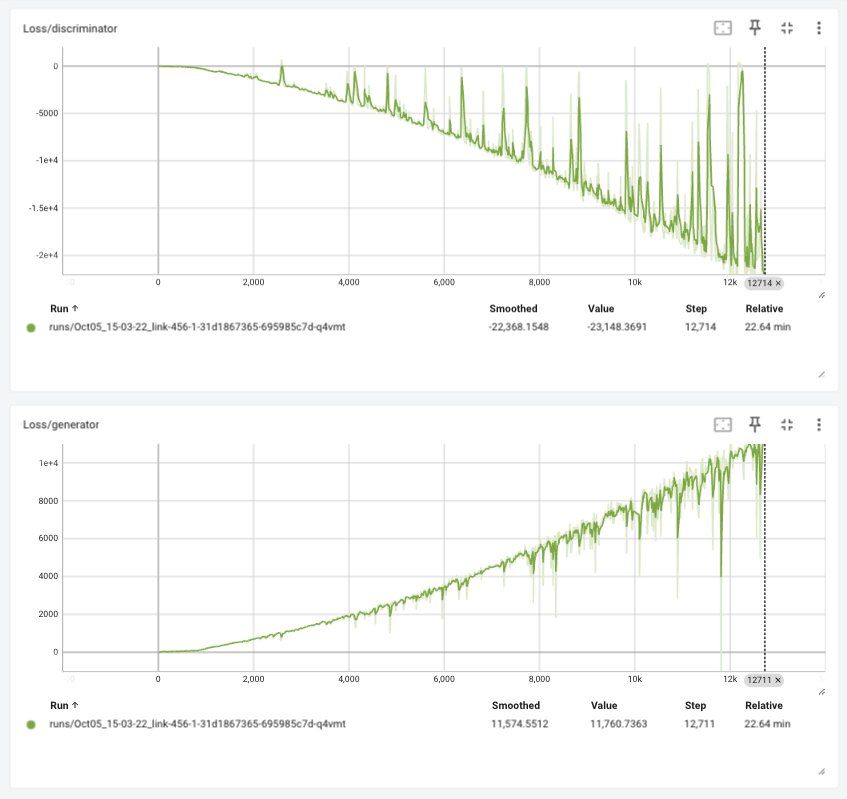
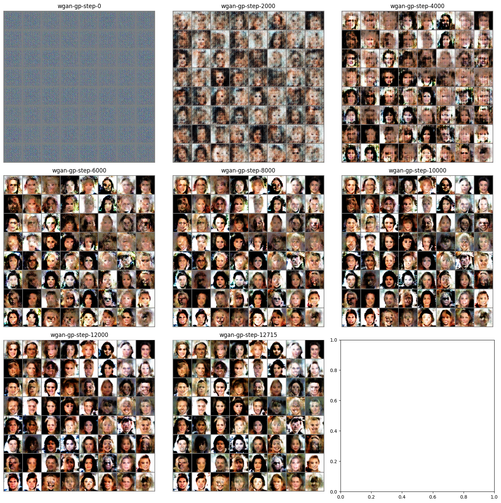
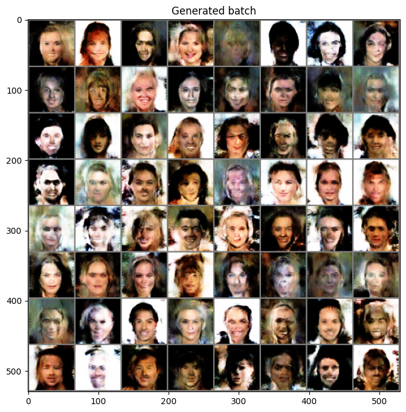

# Wasserstein GAN w\ Gradient Penalty

import CodeDescription from "@site/src/components/CodeDescription";
import BrowserWindow from "@site/src/components/BrowserWindow";

이번 페이지에서는 기존 Wasserstein GAN 에서 Exploding and vanishing gradients 문제를 해결한 WGAN-GP 대해서 구현합니다.

## Paper

<CodeDescription>
    논문에서 제시하는 수정된 최적화 알고리즘은 다음과 같습니다.
    
</CodeDescription>

기존 WGAN 에서 사용한 학습 코드를 수도코드로 작성하면 다음과 같습니다.

```python showLineNumbers
for epoch in range(n_epochs):
    for step, batch in enumerate(loader):
        #
        # 1. get discriminator loss from real data
        #
        ...
        #
        # 2. get discriminator loss from fake data
        #
        ...
        #
        # 3. get discriminator loss and update discriminator
        #
        ...
        #
        # 4. clip weight
        #
        ...
        if step % n_critic == 0: # in paper suggested n_critic is 5
            #
            # 5. get generator loss and update generator
            #
            ...
```

WGAN-GP 알고리즘을 Python 수도 코드로 작성하면 다음과 같습니다.

<CodeDescription>
```python showLineNumbers
for epoch in range(n_epochs):
    for step, batch in enumerate(loader):
        #
        # 1. get discriminator loss from real data
        #
        ...
        #
        # 2. get discriminator loss from fake data
        #
        ...
        #
        # 3. calculate penalty
        #
        ...
        #
        # 4. get discriminator loss and update discriminator
        #
        ...
        if step % n_critic == 0: # in paper suggested n_critic is 5
            #
            # 5. get generator loss and update generator
            #
            ...
```
cliping 을 해주던 WGAN 과 다르게 gradient 의 패널티를 계산하는 부분이 추가되었습니다.
```python {5-7}
for epoch in range(n_epochs):
    for batch in loader:
        for n in range(n_critic): # in paper suggested n_critic is 5
            ...
            #
            # 3. calculate penalty
            #
            ...
```
</CodeDescription>


## Dataset

우선 튜토리얼에 들어가기에 앞서 사용할 데이터셋을 선언합니다.
데이터셋에 대한 자세한 설명은 [CelebA](../dataset/celeba) 페이지에서 확인할 수 있습니다.

우선 배치 사이즈를 논문에서 제시하는 mini batch 숫자와 맞추기 위해 64로 설정합니다.
또한 배치 사이즈가 다를 경우 의도한 대로 학습이 안 될 수 있기 때문에 64가 안될 수 있는 마지막 배치는 사용하지 않도록 `drop_last=True` 로 선언합니다.

```python showLineNumbers
import torchvision.transforms as T
import numpy as np
import matplotlib.pyplot as plt
from torchvision.datasets.celeba import CelebA
from torch.utils.data import DataLoader
from torchvision.utils import make_grid


transform = T.Compose(
    [
        T.Resize(64),
        T.CenterCrop(64),
        T.ToTensor(),
        T.Normalize((0.5, 0.5, 0.5), (0.5, 0.5, 0.5)),
    ]
)
dataset = CelebA(
    "./datasets", download=True, transform=transform
)
loader = DataLoader(dataset, batch_size=64, shuffle=True, drop_last=True)
```

## Model

### Generator
WGAN 에서는 생성기는 DCGAN 에서 사용한 모델을 그대로 사용합니다.
생성기에 대한 자세한 설명은 [DCGAN](./dcgan) 페이지에서 확인할 수 있습니다.

```python showLineNumbers
import torch
import torch.nn as nn


class Generator(nn.Module):
    def __init__(self, num_channel=3, latent_dim=100, feature_dim=64):
        super().__init__()

        self.layer_1 = nn.Sequential(
            nn.ConvTranspose2d(latent_dim, feature_dim * 8, 4, 1, 0, bias=False),
            nn.BatchNorm2d(feature_dim * 8),
            nn.ReLU(True),
        )
        self.layer_2 = nn.Sequential(
            nn.ConvTranspose2d(feature_dim * 8, feature_dim * 4, 4, 2, 1, bias=False),
            nn.BatchNorm2d(feature_dim * 4),
            nn.ReLU(True),
        )
        self.layer_3 = nn.Sequential(
            nn.ConvTranspose2d(feature_dim * 4, feature_dim * 2, 4, 2, 1, bias=False),
            nn.BatchNorm2d(feature_dim * 2),
            nn.ReLU(True),
        )
        self.layer_4 = nn.Sequential(
            nn.ConvTranspose2d(feature_dim * 2, feature_dim, 4, 2, 1, bias=False),
            nn.BatchNorm2d(feature_dim),
            nn.ReLU(True),
        )
        self.last_layer = nn.Sequential(
            nn.ConvTranspose2d(feature_dim, num_channel, 4, 2, 1, bias=False),
            nn.Tanh(),
        )

    def forward(self, z):
        # decoding
        layer_1_out = self.layer_1(z)  # (N, 512, 4, 4)
        layer_2_out = self.layer_2(layer_1_out)  # (N, 256, 8, 8)
        layer_3_out = self.layer_3(layer_2_out)  # (N, 128, 16, 16)
        layer_4_out = self.layer_4(layer_3_out)  # (N, 64, 32, 32)
        # transform to rgb
        out = self.last_layer(layer_4_out)  # (N, 3, 64, 64)
        return out
```

### Discriminator

분류기에 대한 부분을 작성합니다.

```python showLineNumbers
class Discriminator(nn.Module):
    def __init__(self, num_channel=3, feature_dim=64):
        super().__init__()
        self.layer_1 = nn.Sequential(
            nn.Conv2d(num_channel, feature_dim, 4, 2, 1, bias=False),
            nn.InstanceNorm2d(feature_dim, affine=True),
            nn.LeakyReLU(0.2, inplace=True),
        )
        self.layer_2 = nn.Sequential(
            nn.Conv2d(feature_dim, feature_dim * 2, 4, 2, 1, bias=False),
            nn.InstanceNorm2d(feature_dim * 2, affine=True),
            nn.LeakyReLU(0.2, inplace=True),
        )
        self.layer_3 = nn.Sequential(
            nn.Conv2d(feature_dim * 2, feature_dim * 4, 4, 2, 1, bias=False),
            nn.InstanceNorm2d(feature_dim * 4, affine=True),
            nn.LeakyReLU(0.2, inplace=True),
        )
        self.layer_4 = nn.Sequential(
            nn.Conv2d(feature_dim * 4, feature_dim * 8, 4, 2, 1, bias=False),
            nn.InstanceNorm2d(feature_dim * 8, affine=True),
            nn.LeakyReLU(0.2, inplace=True),
        )

        self.last_layer = nn.Sequential(
            nn.Conv2d(feature_dim * 8, 1, 4, 1, 0, bias=False)
        )

    def forward(self, x):
        # encoding
        layer_1_out = self.layer_1(x)  # (N, 64, 32, 32)
        layer_2_out = self.layer_2(layer_1_out)  # (N, 128, 16, 16)
        layer_3_out = self.layer_3(layer_2_out)  # (N, 256, 8, 8)
        layer_4_out = self.layer_4(layer_3_out)  # (N, 512, 4, 4)
        # classify
        out = self.last_layer(layer_4_out).squeeze()  # (N)
        return out
```

분류기에서는 더 이상 Bathcnorm 을 사용하지 않습니다.

<CodeDescription>
**No critic batch normalization**

Most prior GAN implementations [22, 23, 2] use batch normalization in both the generator and the discriminator to help stabilize training, but batch normalization
changes the form of the discriminator’s problem from mapping a single input to a single output to
mapping from an entire batch of inputs to a batch of outputs [23]. Our penalized training objective
is no longer valid in this setting, since we penalize the norm of the critic’s gradient with respect
to each input independently, and not the entire batch.

- To resolve this, we simply omit batch normalization in the critic in our models, finding that they perform well without it. Our method works with normalization schemes which don’t introduce correlations between examples. 
- In particular, werecommend layer normalization [3] as a drop-in replacement for batch normalization.
</CodeDescription>

- 추후 설명할 학습 과정의 gradient penalty 부분이 이미 정규화 부분을 처리함으로 BatchnNorm 을 사용하지 않습니다.
- 대신 Layer normalization 을 제시하지만, pytorch 에서 적절한 부분이 없어서 `InstanceNorm2d` 로 대체합니다.

또한 WGAN 과 마찬가지로 마지막 layer 에서 sigmoid 를 사용하지 않습니다.


## WGAN-GP Train

이제 위에서 작성한 수도 코드의 내용을 채워서 학습을 진행해 보겠습니다.


### Weight Initialization
DCGAN 에서 적용했던 내용을 같이 설정합니다.

파라미터 초기화를 위한 함수를 작성합니다.

```python showLineNumbers
def weights_init(m):
    classname = m.__class__.__name__
    if classname.find("Conv") != -1:
        nn.init.normal_(m.weight.data, 0.0, 0.02)
    elif classname.find("BatchNorm") != -1:
        nn.init.normal_(m.weight.data, 1.0, 0.02)
        nn.init.constant_(m.bias.data, 0)
```

각 모델에 적용합니다.

```python showLineNumbers
_ = generator.apply(weights_init)
_ = discriminator.apply(weights_init)
```

Convolution Network 는 원활한 학습을 위해서는 gpu 가 필요합니다.
GPU 가 없는 경우 학습에 다소 시간이 소요될 수 있습니다.

아래 코드를 이용해 device 를 선언합니다.
만약 gpu 가 사용 가능한 경우 `device(type='cuda')` 메세지가 나옵니다.

<BrowserWindow>
```python showLineNumbers
device = torch.device("cuda" if torch.cuda.is_available() else "cpu")
device
```
```python
device(type='cuda')
```
</BrowserWindow>

위에서 선언한 모델을 gpu 메모리로 옮기겠습니다.

```python showLineNumbers
_ = discriminator.to(device)
_ = generator.to(device)
```

### Logger
학습 과정을 tensorboard 에 저장하기 위한 writer 입니다.

```python showLineNumbers
from torch.utils.tensorboard import SummaryWriter
# tensorboard logger
writer = SummaryWriter()
```

### Loss

위의 Discriminator 에서 설명한 것 과 같이 WGAN 에서는 loss term 을 분류기의 거리의 평균을 이용하기 때문에 따로 선언하지 않습니다.

### Optimizer

논문에서는 제시하는 Adam 을 사용하며 learning_rate는 제시된 0.0001, beta는 0.5, 0.9 를 사용합니다.

```python showLineNumbers
import torch.optim as optim

# optimizer
discriminator_opt = optim.Adam(discriminator.parameters(), lr=0.0001, betas=(0.5, 0.9))
generator_opt = optim.Adam(generator.parameters(), lr=0.0001, betas=(0.5, 0.9))
```

### Gradient Penalty

이번에는 WGAN-GP 에서 GP 를 뜻하는 gradient penalty 를 계산하는 부분을 작성해야 합니다.

논문에서는 해당 term 을 계산하기 위해서 다음과 같이 제시합니다.
<CodeDescription>
$\text{Sample real data } x\text{\textasciitilde}ℙ_{r}, \text{latent variable }z \text{\textasciitilde} p(z), \text{a random number }\epsilon\text{\textasciitilde} U[0, 1].\\$
$\tilde{x} \leftarrow G_{\theta} (z)$  
$\hat{x} \leftarrow \epsilon x + (1-\epsilon) \tilde{x}$  
$L^{(i)} \leftarrow D_{w}(\tilde{x}) - D_{w}(x) + \lambda (||\nabla_{\hat{x}D_{w}(\hat{x})}||_{2}-1)^{2}$
</CodeDescription>

<CodeDescription>
```python showLineNumbers
def compute_gradient_penalty(discriminator, real_data, fake_data):
    device = real_data.device
    alpha = torch.rand(real_data.size(0), 1).to(device)
    alpha = alpha.expand(real_data.size())

    interpolates = alpha * real_data + ((1 - alpha) * fake_data)
    interpolates = interpolates.to(device)
    interpolates = torch.autograd.Variable(interpolates, requires_grad=True)

    disc_interpolates = discriminator(interpolates)
    grad_outputs = torch.ones(disc_interpolates.size(), requires_grad=False).to(device)
    gradients = torch.autograd.grad(
        outputs=disc_interpolates,
        inputs=interpolates,
        grad_outputs=grad_outputs,
        create_graph=True,
        retain_graph=True,
        only_inputs=True,
    )[0]
    gradients = gradients = gradients.view(gradients.size(0), -1)
    gradient_penalty = ((gradients.norm(2, dim=1) - 1) ** 2).mean()
    return gradient_penalty
```
random number 를 추출하는 부분입니다.
```python {3,4}
def compute_gradient_penalty(discriminator, real_data, fake_data):
    ...
    alpha = torch.rand(real_data.size(0), 1).to(device)
    alpha = alpha.expand(real_data.size())
    ...
```
$\hat{x}$ 를 계산합니다.
```python {3,4}
def compute_gradient_penalty(discriminator, real_data, fake_data):
    ...
    interpolates = alpha * real_data + ((1 - alpha) * fake_data)
    interpolates = interpolates.to(device)
    interpolates = torch.autograd.Variable(interpolates, requires_grad=True)
    ...
```

위에서 만든 $\hat{x}$ 를 이용해 $\nabla_{\hat{x}D_{w}(\hat{x})}$ 의 Gradient 를 계산합니다.
```python {3-12}
def compute_gradient_penalty(discriminator, real_data, fake_data):
    ...
    disc_interpolates = discriminator(interpolates)
    grad_outputs = torch.ones(disc_interpolates.size(), requires_grad=False).to(device)
    gradients = torch.autograd.grad(
        outputs=disc_interpolates,
        inputs=interpolates,
        grad_outputs=grad_outputs,
        create_graph=True,
        retain_graph=True,
        only_inputs=True,
    )[0]
    ...
```
위에서 계산한 gradient 를 이용해 $(||\nabla_{\hat{x}}D_{w}(\hat{x})||_{2}-1)^{2}$ 를 계산합니다.
```python {3-4}
def compute_gradient_penalty(discriminator, real_data, fake_data):
    ...
    gradients = gradients = gradients.view(gradients.size(0), -1)
    gradient_penalty = ((gradients.norm(2, dim=1) - 1) ** 2).mean()
    ...
```
</CodeDescription>

### Code

학습하는 코드는 기본적을 WGAN 을 따릅니다. 자세한 내용은 [WGAN](./wgan) 에서 확인하시면 됩니다.

<CodeDescription>
<BrowserWindow>
```python showLineNumbers
from tqdm import tqdm


# for meta
n_epochs = 5
n_critic = 5
lambda_gp = 10

# for visualization
iteration = 0
fixed_z = torch.randn((64, latent_dim, 1, 1)).to(device)

# for iteration history
G_loss_history = []
D_loss_history = []


# train code
for epoch in range(n_epochs):
    epoch_G_loss = 0.0
    epoch_D_loss = 0.0

    for step, batch in enumerate(tqdm(loader, desc=f"Epoch {epoch + 1}/{n_epochs}")):
        step += 1
        generator.train()
        discriminator.train()

        x = batch[0].to(device)
        batch_size = x.size(0)

        #
        # 1. get discriminator loss from real data
        #
        discriminator_opt.zero_grad()
        real_D_score = discriminator(x)
        real_D_loss = real_D_score.mean()
        #
        # 2. get discriminator loss from fake data
        #
        z = torch.randn((batch_size, latent_dim, 1, 1)).to(device)
        fake_data = generator(z)
        fake_D_score = discriminator(fake_data)
        fake_D_loss = fake_D_score.mean()
        #
        # 3. calculate penalty
        #
        gradient_penalty = compute_gradient_penalty(discriminator, x, fake_data)
        #
        # 4. get discriminator loss and update discriminator
        #
        D_wasserstein_loss = -real_D_loss + fake_D_loss + lambda_gp * gradient_penalty
        D_wasserstein_loss.backward()
        discriminator_opt.step()

        # logging
        D_loss_history += [D_wasserstein_loss.item()]
        epoch_D_loss += D_wasserstein_loss.item() * len(x) / len(loader.dataset)
        writer.add_scalar("Loss/discriminator", D_wasserstein_loss, iteration)
        #
        # 5. get generator loss and update generator after n_critic
        #
        if step % n_critic == 0:
            generator_opt.zero_grad()
            z = torch.randn((batch_size, latent_dim, 1, 1)).to(device)
            generated_data = generator(z)
            generate_D_score = discriminator(generated_data)
            G_loss = -generate_D_score.mean()
            G_loss.backward()
            generator_opt.step()
            
            # logging
            G_loss_history += [G_loss.item()]
            epoch_G_loss += G_loss.item() * len(x) / len(loader.dataset) * n_critic
            writer.add_scalar("Loss/generator", G_loss, iteration)

        # iteration checkpoint
        if iteration % 2000 == 0:
            # visualization
            with torch.no_grad():
                generated_x = generator(fixed_z)
                generated_x = generated_x.detach().cpu()
                generated_x_grid = make_grid(generated_x, nrow=8).numpy()
                generated_x_grid = (generated_x_grid * 0.5) + 0.5
                generated_x_grid = np.transpose(generated_x_grid, (1, 2, 0))
                plt.imsave(f"wgan-gp-step-{iteration}.png", generated_x_grid)
            # model save
            torch.save(generator, f"wgan-gp-generator-step-{iteration}.pt")
        iteration += 1
    log_string = f"Loss at epoch {epoch + 1} - D_loss : {epoch_D_loss:.4f}, G_loss : {epoch_G_loss:.4f}"
    print(log_string)

# save last model
with torch.no_grad():
    generated_x = generator(fixed_z)
    generated_x = generated_x.detach().cpu()
    generated_x_grid = make_grid(generated_x, nrow=8).numpy()
    generated_x_grid = (generated_x_grid * 0.5) + 0.5
    generated_x_grid = np.transpose(generated_x_grid, (1, 2, 0))
    plt.imsave(f"wgan-gp-step-{iteration}.png", generated_x_grid)
torch.save(generator, f"wgan-gp-generator-step-{iteration}.pt")
```
```python
Epoch 1/5: 100%|██████████| 2543/2543 [03:49<00:00, 11.09it/s]
Loss at epoch 1 - D_loss : -478.6814, G_loss : 267.3584
Epoch 2/5: 100%|██████████| 2543/2543 [03:46<00:00, 11.25it/s]
Loss at epoch 2 - D_loss : -1605.9598, G_loss : 1060.6701
Epoch 3/5: 100%|██████████| 2543/2543 [03:45<00:00, 11.27it/s]
Loss at epoch 3 - D_loss : -3825.8270, G_loss : 2039.2957
Epoch 4/5: 100%|██████████| 2543/2543 [03:46<00:00, 11.22it/s]
Loss at epoch 4 - D_loss : -5327.3705, G_loss : 2883.1035
Epoch 5/5: 100%|██████████| 2543/2543 [03:45<00:00, 11.28it/s]
Loss at epoch 5 - D_loss : -6928.6919, G_loss : 3699.7643
```
</BrowserWindow>

gradient penalty 를 계산합니다.

```python {8}
# train code
for epoch in range(n_epochs):
    for step, batch in enumerate(tqdm(loader, desc=f"Epoch {epoch + 1}/{n_epochs}")):
        ...
        #
        # 3. calculate penalty
        #
        gradient_penalty = compute_gradient_penalty(discriminator, x, fake_data)
        ...
```

discriminator 를 학습할 loss 를 생성합니다. 기존 WGAN 과 다른 점은 gradient penalty 가 추가되었습니다.
이때 lambda_gp 는 논문에서 제시한 10을 사용합니다.

```python {4,13}
# for meta
n_epochs = 5
n_critic = 5
lambda_gp = 10

# train code
for epoch in range(n_epochs):
    for step, batch in enumerate(tqdm(loader, desc=f"Epoch {epoch + 1}/{n_epochs}")):
        ...
        #
        # 4. get discriminator loss and update discriminator
        #
        D_wasserstein_loss = -real_D_loss + fake_D_loss + lambda_gp * gradient_penalty
        D_wasserstein_loss.backward()
        discriminator_opt.step()
        ...
```
</CodeDescription>

### Train loss

Tensorboard 에 로깅된 학습 정보를 확인하면 다음과 같습니다.



### Visualize

학습을 하면서 생성기가 어떻게 이미지를 생성하는 지 확인해 보겠습니다.

<BrowserWindow>
```python showLineNumbers
import os

img_list = list(sorted(filter(lambda x: x.startswith("wgan-gp-step"), os.listdir("."))))
step_filename = {}
for fname in filter(lambda x: x.startswith("wgan-gp-step"), os.listdir(".")):
    key = int(fname.replace("wgan-gp-step-", "").replace(".png", ""))
    step_filename[key] = fname

nrows = (len(img_list) // 3) + 1

fig, axes = plt.subplots(ncols=3, nrows=nrows, figsize=(5 * nrows, 15))
for idx, key in enumerate(sorted(step_filename)):
    fname = step_filename[key]
    array = plt.imread(fname)
    axes[idx // 3, idx % 3].imshow(array)
    axes[idx // 3, idx % 3].axis("off")
    axes[idx // 3, idx % 3].set_title(fname.replace(".png", ""))

plt.tight_layout()
```

</BrowserWindow>

## Generation

이번에는 학습한 모델의 디코더를 이용해 랜덤한 latent 값을 주었을 때 어떤 이미지를 생성하는 지 확인해 보겠습니다.
다만 이번 생성기의 경우 BatchNorm 을 사용하기 때문에 학습과 평가 모드에 따라서 동작이 달라집니다.
학습이 끝난 모델을 사용하기 위해서는 `eval()` 모드를 설정해주어야 합니다.

<BrowserWindow>
```python showLineNumbers
generator.eval()
with torch.no_grad():    
    random_z = torch.randn((64, latent_dim, 1, 1)).to(device)
    generated_x = generator(random_z)

generated_x_grid = make_grid(generated_x, nrow=8).cpu().numpy()
# make data range to 0~1
generated_x_grid = (generated_x_grid * 0.5) + 0.5
plt.figure(figsize=(8, 8))
plt.title("Generated batch")
plt.imshow(np.transpose(generated_x_grid, (1, 2, 0)))
```

</BrowserWindow>

## References

- https://arxiv.org/pdf/1704.00028
- https://jonathan-hui.medium.com/gan-wasserstein-gan-wgan-gp-6a1a2aa1b490
- https://github.com/Zeleni9/pytorch-wgan
