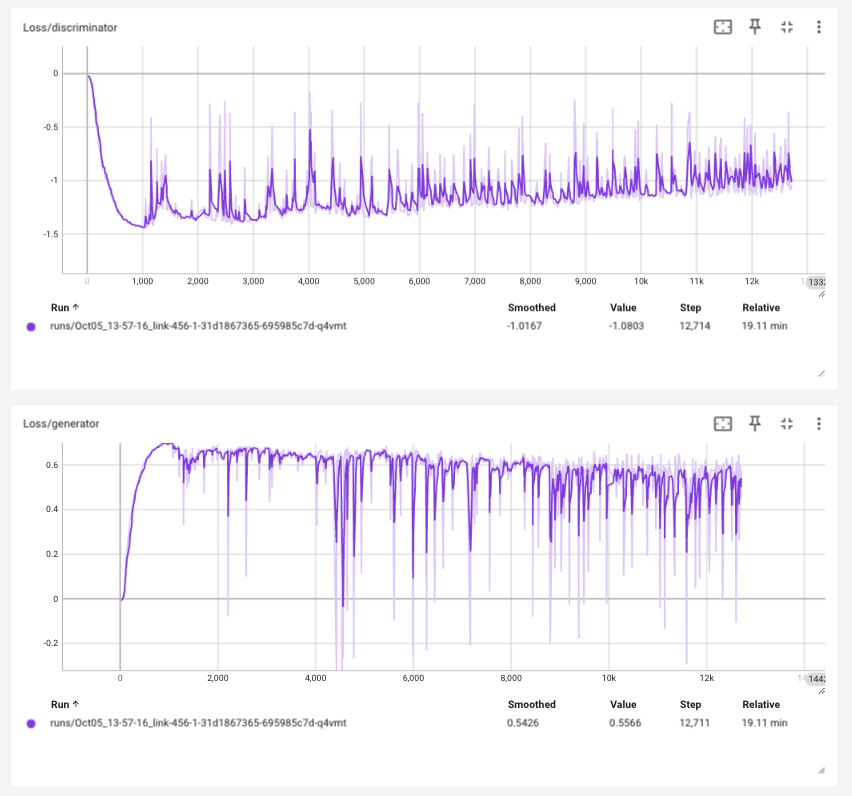

# Wasserstein GAN

import CodeDescription from "@site/src/components/CodeDescription";
import BrowserWindow from "@site/src/components/BrowserWindow";

이번 페이지에서는 기존 GAN 에서 사용하던 Mean Squared Error 를 수정해 학습 안정성을 확보한 Wasserstein GAN 에 대해서 구현합니다.

## Paper

<CodeDescription>
    논문에서 제시하는 최적화 알고리즘은 다음과 같습니다.
    
</CodeDescription>

기존 DCGAN 에서 사용한 학습 코드를 수도코드로 작성하면 다음과 같습니다.

```python showLineNumbers
for epoch in range(n_epochs):
    for batch in loader:
        #
        # 1. get discriminator loss from real data
        #
        ...
        #
        # 2. get discriminator loss from fake data
        #
        ...
        #
        # 3. get discriminator loss and update discriminator
        #
        ...
        #
        # 4. get generator loss and update generator
        #
        ...
```

Wasserstein 알고리즘을 Python 수도 코드로 작성하면 다음과 같습니다.

<CodeDescription>
```python showLineNumbers
for epoch in range(n_epochs):
    for step, batch in enumerate(loader):
        #
        # 1. get discriminator loss from real data
        #
        ...
        #
        # 2. get discriminator loss from fake data
        #
        ...
        #
        # 3. get discriminator loss and update discriminator
        #
        ...
        #
        # 4. clip weight
        #
        ...
        if step % n_critic == 0: # in paper suggested n_critic is 5
            #
            # 5. get generator loss and update generator
            #
            ...
```

학습기를 학습한 이후 파라미터를 주어진 값으로 최소와 최대값을 제한합니다.
논문에서는 이 값을 $c=0.01$ 로 제시했습니다.
```python {4-6}
for epoch in range(n_epochs):
    for step, batch in enumerate(loader):
        ...
        #
        # 4. clip weight
        #
        ...
```

논문에서는 분류기의 학습이 $n_{critic}$ 만큼 진행 후 생성기를 학습하도록 제안했습니다.
이를 위해서 주어진 step 의 나머지가 0이 될 때 생성기를 학습하는 분기를 선언합니다.
```python {4}
for epoch in range(n_epochs):
    for step, batch in enumerate(loader):
        ...
        if step % n_critic == 0: # in paper suggested n_critic is 5
            #
            # 5. get generator loss and update generator
            #
            ...
```

</CodeDescription>


## Dataset

우선 튜토리얼에 들어가기에 앞서 사용할 데이터셋을 선언합니다.
데이터셋에 대한 자세한 설명은 [CelebA](../dataset/celeba) 페이지에서 확인할 수 있습니다.

우선 배치 사이즈를 논문에서 제시하는 mini batch 숫자와 맞추기 위해 64로 설정합니다.
또한 배치 사이즈가 다를 경우 의도한 대로 학습이 안 될 수 있기 때문에 64가 안될 수 있는 마지막 배치는 사용하지 않도록 `drop_last=True` 로 선언합니다.

```python showLineNumbers
import torchvision.transforms as T
import numpy as np
import matplotlib.pyplot as plt
from torchvision.datasets.celeba import CelebA
from torch.utils.data import DataLoader
from torchvision.utils import make_grid


transform = T.Compose(
    [
        T.Resize(64),
        T.CenterCrop(64),
        T.ToTensor(),
        T.Normalize((0.5, 0.5, 0.5), (0.5, 0.5, 0.5)),
    ]
)
dataset = CelebA(
    "./datasets", download=True, transform=transform
)
loader = DataLoader(dataset, batch_size=64, shuffle=True, drop_last=True)
```

## Model

WGAN 에서는 학습 방법만 수정을 하기 때문에 모델은 DCGAN 에서 사용한 모델을 그대로 사용합니다.
생성기와 분류기에 대한 자세한 설명은 [DCGAN](./dcgan) 페이지에서 확인할 수 있습니다.


### Generator
```python showLineNumbers
import torch
import torch.nn as nn


class Generator(nn.Module):
    def __init__(self, num_channel=3, latent_dim=100, feature_dim=64):
        super().__init__()

        self.layer_1 = nn.Sequential(
            nn.ConvTranspose2d(latent_dim, feature_dim * 8, 4, 1, 0, bias=False),
            nn.BatchNorm2d(feature_dim * 8),
            nn.ReLU(True),
        )
        self.layer_2 = nn.Sequential(
            nn.ConvTranspose2d(feature_dim * 8, feature_dim * 4, 4, 2, 1, bias=False),
            nn.BatchNorm2d(feature_dim * 4),
            nn.ReLU(True),
        )
        self.layer_3 = nn.Sequential(
            nn.ConvTranspose2d(feature_dim * 4, feature_dim * 2, 4, 2, 1, bias=False),
            nn.BatchNorm2d(feature_dim * 2),
            nn.ReLU(True),
        )
        self.layer_4 = nn.Sequential(
            nn.ConvTranspose2d(feature_dim * 2, feature_dim, 4, 2, 1, bias=False),
            nn.BatchNorm2d(feature_dim),
            nn.ReLU(True),
        )
        self.last_layer = nn.Sequential(
            nn.ConvTranspose2d(feature_dim, num_channel, 4, 2, 1, bias=False),
            nn.Tanh(),
        )

    def forward(self, z):
        # decoding
        layer_1_out = self.layer_1(z)  # (N, 512, 4, 4)
        layer_2_out = self.layer_2(layer_1_out)  # (N, 256, 8, 8)
        layer_3_out = self.layer_3(layer_2_out)  # (N, 128, 16, 16)
        layer_4_out = self.layer_4(layer_3_out)  # (N, 64, 32, 32)
        # transform to rgb
        out = self.last_layer(layer_4_out)  # (N, 3, 64, 64)
        return out
```

### Discriminator

```python showLineNumbers
class Discriminator(nn.Module):
    def __init__(self, num_channel=3, feature_dim=64):
        super().__init__()
        self.layer_1 = nn.Sequential(
            nn.Conv2d(num_channel, feature_dim, 4, 2, 1, bias=False),
            nn.BatchNorm2d(feature_dim),
            nn.LeakyReLU(0.2, inplace=True),
        )
        self.layer_2 = nn.Sequential(
            nn.Conv2d(feature_dim, feature_dim * 2, 4, 2, 1, bias=False),
            nn.BatchNorm2d(feature_dim * 2),
            nn.LeakyReLU(0.2, inplace=True),
        )
        self.layer_3 = nn.Sequential(
            nn.Conv2d(feature_dim * 2, feature_dim * 4, 4, 2, 1, bias=False),
            nn.BatchNorm2d(feature_dim * 4),
            nn.LeakyReLU(0.2, inplace=True),
        )
        self.layer_4 = nn.Sequential(
            nn.Conv2d(feature_dim * 4, feature_dim * 8, 4, 2, 1, bias=False),
            nn.BatchNorm2d(feature_dim * 8),
            nn.LeakyReLU(0.2, inplace=True),
        )

        self.last_layer = nn.Sequential(
            nn.Conv2d(feature_dim * 8, 1, 4, 1, 0, bias=False), nn.Sigmoid()
        )

    def forward(self, x):
        # encoding
        layer_1_out = self.layer_1(x)  # (N, 64, 32, 32)
        layer_2_out = self.layer_2(layer_1_out)  # (N, 128, 16, 16)
        layer_3_out = self.layer_3(layer_2_out)  # (N, 256, 8, 8)
        layer_4_out = self.layer_4(layer_3_out)  # (N, 512, 4, 4)
        # classify
        out = self.last_layer(layer_4_out).squeeze()  # (N)
        return out
```

## WGAN Train

이제 위에서 작성한 수도 코드의 내용을 채워서 학습을 진행해 보겠습니다.

### Weight Initialization
DCGAN 에서 적용했던 내용을 같이 설정합니다.

파라미터 초기화를 위한 함수를 작성합니다.

```python showLineNumbers
def weights_init(m):
    classname = m.__class__.__name__
    if classname.find("Conv") != -1:
        nn.init.normal_(m.weight.data, 0.0, 0.02)
    elif classname.find("BatchNorm") != -1:
        nn.init.normal_(m.weight.data, 1.0, 0.02)
        nn.init.constant_(m.bias.data, 0)
```

각 모델에 적용합니다.

```python showLineNumbers
_ = generator.apply(weights_init)
_ = discriminator.apply(weights_init)
```

Convolution Network 는 원활한 학습을 위해서는 gpu 가 필요합니다.
GPU 가 없는 경우 학습에 다소 시간이 소요될 수 있습니다.

아래 코드를 이용해 device 를 선언합니다.
만약 gpu 가 사용 가능한 경우 `device(type='cuda')` 메세지가 나옵니다.

<BrowserWindow>
```python showLineNumbers
device = torch.device("cuda" if torch.cuda.is_available() else "cpu")
device
```
```python
device(type='cuda')
```
</BrowserWindow>

위에서 선언한 모델을 gpu 메모리로 옮기겠습니다.

```python showLineNumbers
_ = discriminator.to(device)
_ = generator.to(device)
```

### Logger
학습 과정을 tensorboard 에 저장하기 위한 writer 입니다.

```python showLineNumbers
from torch.utils.tensorboard import SummaryWriter
# tensorboard logger
writer = SummaryWriter()
```

### Loss

WGAN 에서는 loss term 을 분류기의 결과의 평균을 이용하기 때문에 따로 선언하지 않습니다.
해당 내용은 아래에서 설명합니다.

### Optimizer

논문에서는 제시하는 RMSProp 을 사용하며 learning_rate 또한 제시된 0.00005 를 사용합니다.

```python showLineNumbers
import torch.optim as optim


# optimizer
discriminator_opt = optim.RMSprop(discriminator.parameters(), lr=0.00005)
generator_opt = optim.RMSprop(generator.parameters(), lr=0.00005)
```

### Code

<CodeDescription>
<BrowserWindow>

```python showLineNumbers
from tqdm import tqdm


# for meta
n_epochs = 5
n_critic = 5
weight_cliping_limit = 0.01

# for visualization
iteration = 0
fixed_z = torch.randn((64, latent_dim, 1, 1)).to(device)

# for iteration history
G_loss_history = []
D_loss_history = []

# train code
for epoch in range(n_epochs):
    epoch_G_loss = 0.0
    epoch_D_loss = 0.0

    for step, batch in enumerate(tqdm(loader, desc=f"Epoch {epoch + 1}/{n_epochs}")):
        step += 1
        generator.train()
        discriminator.train()

        x = batch[0].to(device)
        batch_size = x.size(0)

        #
        # 1. get discriminator loss from real data
        #
        discriminator_opt.zero_grad()
        real_D_score = discriminator(x)
        real_D_loss = real_D_score.mean()
        #
        # 2. get discriminator loss from fake data
        #
        z = torch.randn((batch_size, latent_dim, 1, 1)).to(device)
        fake_data = generator(z)
        fake_D_score = discriminator(fake_data)
        fake_D_loss = fake_D_score.mean()
        #
        # 3. get discriminator loss and update discriminator
        #
        D_wasserstein_loss = -real_D_loss + fake_D_loss
        D_wasserstein_loss.backward()
        discriminator_opt.step()
        #
        # 4. clip weight
        #
        for p in discriminator.parameters():
            p.data.clamp_(
                -weight_cliping_limit, weight_cliping_limit
            )  # in paper suggested c is 0.01
        
        # logging
        D_loss_history += [D_wasserstein_loss.item()]
        epoch_D_loss += D_wasserstein_loss.item() * len(x) / len(loader.dataset)
        writer.add_scalar("Loss/discriminator", D_wasserstein_loss, iteration)
        #
        # 5. get generator loss and update generator after n_critic
        #
        if step % n_critic == 0:
            generator_opt.zero_grad()
            z = torch.randn((batch_size, latent_dim, 1, 1)).to(device)
            generated_data = generator(z)
            generate_D_score = discriminator(generated_data)
            G_loss = -generate_D_score.mean()
            G_loss.backward()
            generator_opt.step()
            
            # logging
            G_loss_history += [G_loss.item()]
            epoch_G_loss += G_loss.item() * len(x) / len(loader.dataset) * n_critic
            writer.add_scalar("Loss/generator", G_loss, iteration)

        # iteration checkpoint
        if iteration % 2000 == 0:
            # visualization
            with torch.no_grad():
                generated_x = generator(fixed_z)
                generated_x = generated_x.detach().cpu()
                generated_x_grid = make_grid(generated_x, nrow=8).numpy()
                generated_x_grid = (generated_x_grid * 0.5) + 0.5
                generated_x_grid = np.transpose(generated_x_grid, (1, 2, 0))
                plt.imsave(f"wgan-step-{iteration}.png", generated_x_grid)
            # model save
            torch.save(generator, f"wgan-generator-step-{iteration}.pt")
        iteration += 1
    log_string = f"Loss at epoch {epoch + 1} - D_loss : {epoch_D_loss:.4f}, G_loss : {epoch_G_loss:.4f}"
    print(log_string)

# save last model
with torch.no_grad():
    generated_x = generator(fixed_z)
    generated_x = generated_x.detach().cpu()
    generated_x_grid = make_grid(generated_x, nrow=8).numpy()
    generated_x_grid = (generated_x_grid * 0.5) + 0.5
    generated_x_grid = np.transpose(generated_x_grid, (1, 2, 0))
    plt.imsave(f"wgan-step-{iteration}.png", generated_x_grid)
torch.save(generator, f"wgan-generator-step-{iteration}.pt")
```
```python
poch 1/5:   0%|          | 0/2543 [00:00<?, ?it/s]
Epoch 1/5: 100%|██████████| 2543/2543 [06:45<00:00,  6.28it/s]
Loss at epoch 1 - D_loss : -0.2854, G_loss : -0.3558
Epoch 2/5: 100%|██████████| 2543/2543 [06:21<00:00,  6.67it/s]
Loss at epoch 2 - D_loss : -0.2878, G_loss : -0.3582
Epoch 3/5: 100%|██████████| 2543/2543 [06:29<00:00,  6.53it/s]
Loss at epoch 3 - D_loss : -0.2777, G_loss : -0.3576
Epoch 4/5: 100%|██████████| 2543/2543 [06:17<00:00,  6.73it/s]
Loss at epoch 4 - D_loss : -0.2553, G_loss : -0.3705
Epoch 5/5: 100%|██████████| 2543/2543 [06:20<00:00,  6.69it/s]
Loss at epoch 5 - D_loss : -0.2351, G_loss : -0.3805
```
</BrowserWindow>


다음으로 계산할 것은 실제 이미지를 분류하는 부분 입니다.
앞서 Vanila GAN 에서 사용한것과 다르게 데이터 로더에서 실제 이미지를 분류기의 확률값의 평균을 loss 로 이용합니다

```python {5,9-11}
# train code
for epoch in range(n_epochs):
    for step, batch in enumerate(tqdm(loader, desc=f"Epoch {epoch + 1}/{n_epochs}")):
        ...
        x = batch[0].to(device)
        #
        # 1. get discriminator loss from real data
        #
        discriminator_opt.zero_grad()
        real_D_score = discriminator(x)
        real_D_loss = real_D_score.mean()
        ...
```

이어서 임의의 latent z 를 선언하고 생성기를 통해서 가짜 이미지를 만듭니다.
이후 생성된 이미지를 분류기의 확률값의 평균을 계산합니다.

```python {8-11}
# train code
for epoch in range(n_epochs):
    for step, batch in enumerate(tqdm(loader, desc=f"Epoch {epoch + 1}/{n_epochs}")):
        ...
        #
        # 2. get discriminator loss from fake data
        #
        z = torch.randn((batch_size, latent_dim, 1, 1)).to(device)
        fake_data = generator(z)
        fake_D_score = discriminator(fake_data)
        fake_D_loss = fake_D_score.mean()
        ...
```

논문에서는 분류기의 weight 를 업데이트하는 수식은 다음과 같습니다.

$$
g_{w}\leftarrow\nabla_{w}\lbrack\frac{1}{m}\textstyle\sum_{i=1}^{m}f_{w}(x^{(i)})-\frac{1}{m}\textstyle\sum_{i=1}^{m}f_{w}(g_{\theta}(z^{(i)}))
$$

그렇기 때문에 두 loss 를 합쳤던 DCGAN 과 다르게 진짜 이미지의 확률값에서 생성된 이미지의 확률값을 뺀 loss 를 이용해 업데이트를 합니다.

```python {8-11}
# train code
for epoch in range(n_epochs):
    for step, batch in enumerate(tqdm(loader, desc=f"Epoch {epoch + 1}/{n_epochs}")):
            ...
            #
            # 3. get discriminator loss and update discriminator
            #
            D_wasserstein_loss = real_D_loss - fake_D_loss
            D_wasserstein_loss.backward()
            discriminator_opt.step()
            critic_D_wasserstein_loss += D_wasserstein_loss.item()
            ...
```

마지막으로 업데이트된 분류기의 파라미터를 clip 합니다.
$$
w\leftarrow\text{clip}(w,-c,c)
$$
```python {4,13-16}
# for meta
n_epochs = 5
n_critic = 5
weight_cliping_limit = 0.01

# train code
for epoch in range(n_epochs):
    for step, batch in enumerate(tqdm(loader, desc=f"Epoch {epoch + 1}/{n_epochs}")):
        ...
        #
        # 4. clip weight
        #
        for p in discriminator.parameters():
            p.data.clamp_(
                -weight_cliping_limit, weight_cliping_limit
            )  # in paper suggested c is 0.01
        ...
```

분류기 학습의 결과물을 logging 하기 위한 코드입니다.

```python {6-8}
# train code
for epoch in range(n_epochs):
    for step, batch in enumerate(tqdm(loader, desc=f"Epoch {epoch + 1}/{n_epochs}")):
        ...
        # logging
        D_loss_history += [D_wasserstein_loss.item()]
        epoch_D_loss += D_wasserstein_loss.item() * len(x) / len(loader.dataset)
        writer.add_scalar("Loss/discriminator", D_wasserstein_loss, iteration)
        ...
```

생성기는 분류기를 $n_{critic}$ 만큼 수행 후 업데이트 합니다.

논문에서는 생성기의 weight 를 업데이트하는 수식은 다음과 같습니다.

$$
g_{w}\leftarrow-\nabla_{w}\frac{1}{m}\textstyle\sum_{i=1}^{m}f_{w}(g_{\theta}(z^{(i)})
$$

이를 위해서 생성된 이미지를 분류기로 분류하고 이에 대한 loss 를 앞선 분류기에서 생성된 이미지에 대해서 더한것과 반대로 평균에 -1 를 곱해서 계산합니다.
이를 통해서 분류기를 속이기 위한 gradient 값을 계산해서 생성기를 업데이트합니다.

```python {8-20}
# train code
for epoch in range(n_epochs):
    for step, batch in enumerate(tqdm(loader, desc=f"Epoch {epoch + 1}/{n_epochs}")):
        ...
        #
        # 5. get generator loss and update generator after n_critic
        #
        if step % n_critic == 0:
            generator_opt.zero_grad()
            z = torch.randn((batch_size, latent_dim, 1, 1)).to(device)
            generated_data = generator(z)
            generate_D_score = discriminator(generated_data)
            G_loss = -generate_D_score.mean()
            G_loss.backward()
            generator_opt.step()
            
            # logging
            G_loss_history += [G_loss.item()]
            epoch_G_loss += G_loss.item() * len(x) / len(loader.dataset) * n_critic
            writer.add_scalar("Loss/generator", G_loss, iteration)
        ...
```

아래 코드는 고정된 z 에 대해서 모델이 학습하면서 생성하는 그림이 어떻게 바뀌는지 저장하기 위한 코드입니다.
```python {2,11-19}
# for visualization
iteration = 0
fixed_z = torch.randn((64, latent_dim, 1, 1)).to(device)

# train code
for epoch in range(n_epochs):
    ...
    for batch in tqdm(loader, desc=f"Epoch {epoch + 1}/{n_epochs}"):
        ...
        # iteration checkpoint
        if iteration % 2000 == 0:
            # visualization
            with torch.no_grad():
                generated_x = generator(fixed_z)
                generated_x = generated_x.detach().cpu()
                generated_x_grid = make_grid(generated_x, nrow=8).numpy()
                generated_x_grid = (generated_x_grid * 0.5) + 0.5
                generated_x_grid = np.transpose(generated_x_grid, (1, 2, 0))
                plt.imsave(f"wgan-step-{iteration}.png", generated_x_grid)
        ...
```
</CodeDescription>

### Visualize

학습을 하면서 생성기가 어떻게 이미지를 생성하는 지 확인해 보겠습니다.

<BrowserWindow>
```python showLineNumbers
import os

img_list = list(sorted(filter(lambda x: x.startswith("wgan-step"), os.listdir("."))))
step_filename = {}
for fname in filter(lambda x: x.startswith("wgan-step"), os.listdir(".")):
    key = int(fname.replace("wgan-step-", "").replace(".png", ""))
    step_filename[key] = fname

nrows = (len(img_list) // 3) + 1

fig, axes = plt.subplots(ncols=3, nrows=nrows, figsize=(5 * nrows, 15))
for idx, key in enumerate(sorted(step_filename)):
    fname = step_filename[key]
    array = plt.imread(fname)
    axes[idx // 3, idx % 3].imshow(array)
    axes[idx // 3, idx % 3].axis("off")
    axes[idx // 3, idx % 3].set_title(fname.replace(".png", ""))

plt.tight_layout()
```

</BrowserWindow>


### Loss history
Tensorboard 에 로깅된 학습 정보를 확인하면 다음과 같습니다.



## Generation

이번에는 학습한 모델의 디코더를 이용해 랜덤한 latent 값을 주었을 때 어떤 이미지를 생성하는 지 확인해 보겠습니다.
다만 이번 생성기의 경우 BatchNorm 을 사용하기 때문에 학습과 평가 모드에 따라서 동작이 달라집니다.
학습이 끝난 모델을 사용하기 위해서는 `eval()` 모드를 설정해주어야 합니다.

<BrowserWindow>
```python showLineNumbers
generator.eval()
with torch.no_grad():    
    random_z = torch.randn((64, latent_dim, 1, 1)).to(device)
    generated_x = generator(random_z)

generated_x_grid = make_grid(generated_x, nrow=8).cpu().numpy()
# make data range to 0~1
generated_x_grid = (generated_x_grid * 0.5) + 0.5
plt.figure(figsize=(8, 8))
plt.title("Generated batch")
plt.imshow(np.transpose(generated_x_grid, (1, 2, 0)))
```

</BrowserWindow>

## References

- https://arxiv.org/pdf/1701.07875
- https://jonathan-hui.medium.com/gan-wasserstein-gan-wgan-gp-6a1a2aa1b490
- https://github.com/Zeleni9/pytorch-wgan
